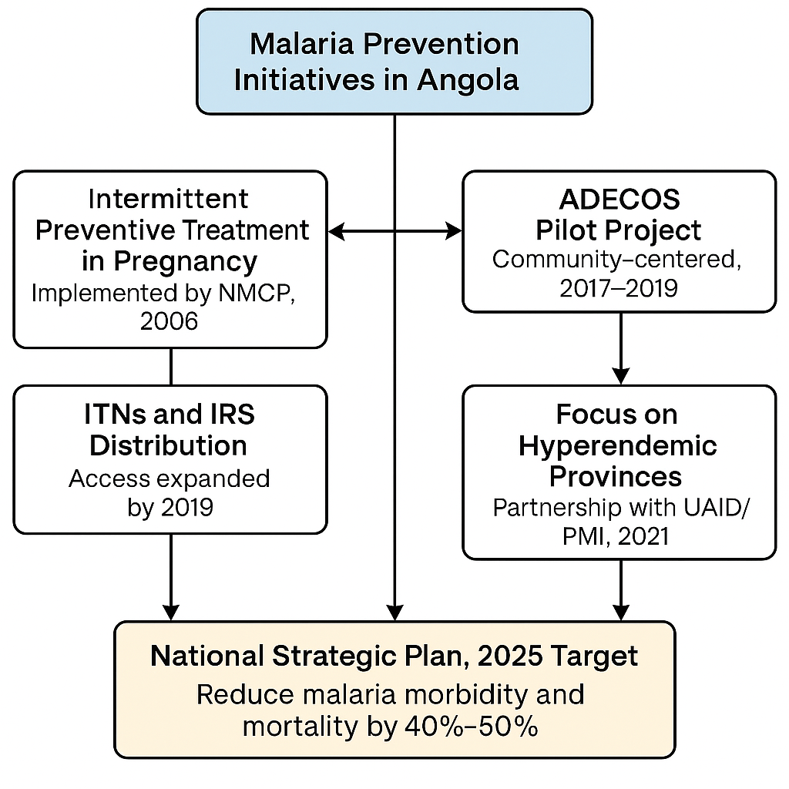
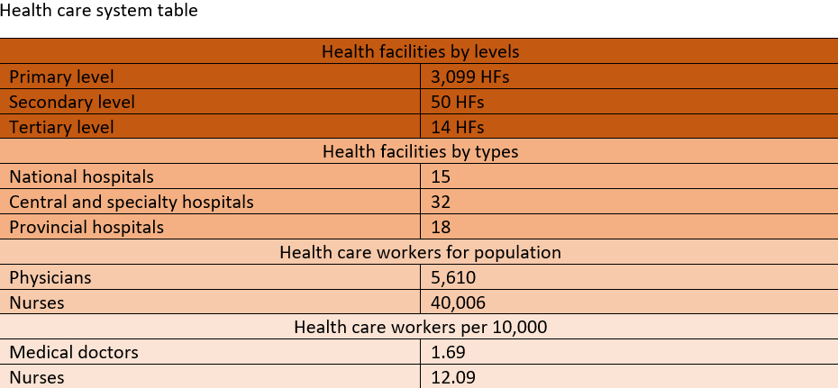
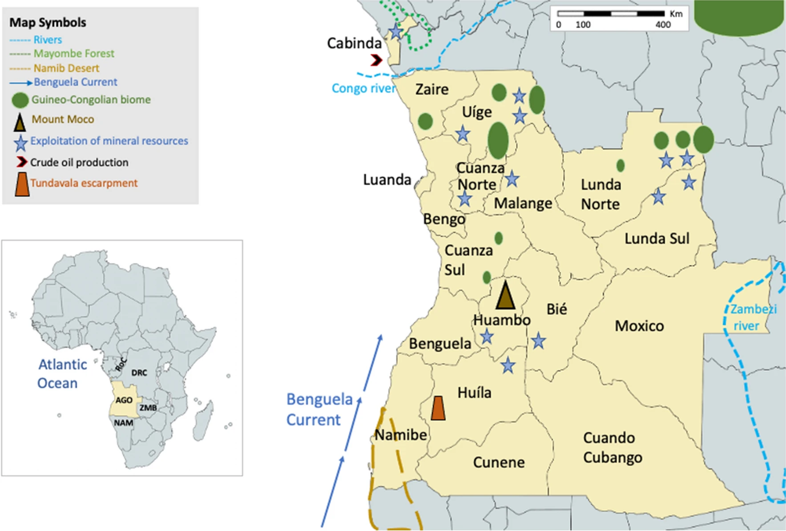
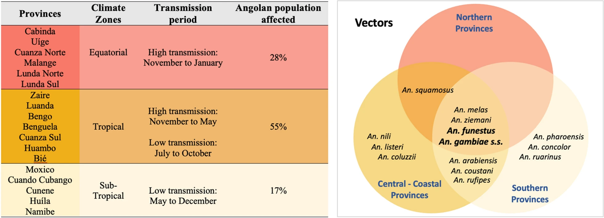
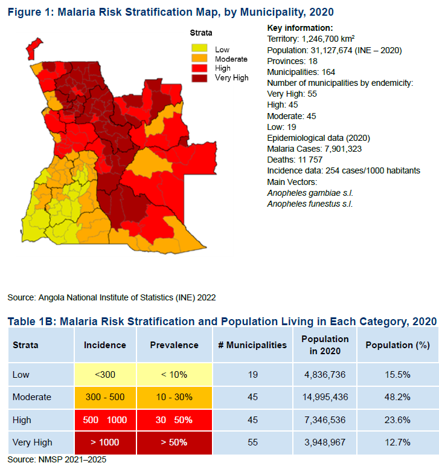

```{r, echo=FALSE, out.width='20%', fig.align='right'}


```


---


### **ANGOLA MALARIA EPIDEMIOLOGY PROFILE**

*Author*: Sarah Leonard

---


```{r, echo = FALSE, message=FALSE, warning=FALSE}

# 
# install.packages("tidyverse")
# install.packages("imager")
# install.packages("plotly")
# install.packages("rnaturalearth")
# install.packages("rnaturalearthdata")
# install.packages("raster")
# install.packages("elevatr")
# install.packages("ggspatial")
# install.packages("leaflet")
```

```{r, echo = FALSE, message=FALSE, warning=FALSE}
library(raster)
library(leaflet)
library(tidyverse)
library(knitr)
library(ggplot2)
library(dplyr)
library(sf)
library(imager)
library(rnaturalearth)
library(rnaturalearthdata)
library(ggspatial)
library(plotly)
library(RColorBrewer)


```


#### **Introduction**


Angola is the seventh-largest country in Africa found on the west-central coast of Southern Africa. It shares borders with Namibia to the south, Democratic Republic of Congo (DRC) to the north,Zambia to the east and Atlantic ocean to the west.It is a Lusophone (Portuguese-speaking) nation, Angola had an population of approximately 36.7 million as of 2023 (WHO). The country is administratively divided into 18 provinces, 164 districts and 557 communes, with Luanda serving as its capital city.


```{r, echo = FALSE, message=FALSE, warning=FALSE}

#loading the shapefiles
angola_provinces <- st_read("ANG/Angola_DIVA_GIS_State_L1_Admin_Boundaries", quiet = TRUE)

# Calculate centroids for labeling
province_centroids <- st_centroid(angola_provinces)

# Extract coordinates to avoid label distortion in long/narrow provinces
province_centroids_coords <- cbind(province_centroids, st_coordinates(st_centroid(province_centroids)))

# Adjust province names to match your data
angola_provinces$zone <- dplyr::case_when(
  angola_provinces$NAME_1 %in% c("Luanda", "Bengo", "Zaire","Uíge","Cabinda","Cuanza Norte") ~ "North",
  angola_provinces$NAME_1 %in% c("Malanje", "Bié", "Cuanza Sul","Lunda Norte","Lunda Sul","Huambo") ~ "Central",
  angola_provinces$NAME_1 %in% c("Namibe", "Huíla", "Cunene","Cuando Cubango","Benguela","Moxico") ~ "South", TRUE ~NA_character_
)

# Extract Luanda's centroid for separate styling
luanda <- angola_provinces %>% filter(NAME_1 == "Luanda")
luanda_centroid <- st_centroid(luanda)
luanda_coords <- st_coordinates(luanda_centroid)
luanda_coords_df <- data.frame(lon = luanda_coords[, 1], lat = luanda_coords[, 2], type= "Capital City")


#angola_provinces %>%
 # filter(is.na(zone)) %>%
  #pull(NAME_1)


map_plot <- ggplot(angola_provinces) +
  geom_sf(aes(fill = zone, text= NAME_1), color = "white", size = 0.3) +
  geom_text(data= province_centroids_coords,
            aes(X, Y,label = NAME_1),
            size = 2.0, fontface = "bold", color = "#2C3E50") +
  #geom_point(data = luanda_coords_df,
             #aes(x = lon, y = lat, color = type, shape = type), size = 1) +
 # scale_shape_manual(name = "", values = c("Capital City" = 5)) +   
  #scale_color_manual(name = "", values = c("Capital City" = "black")) + 

  scale_fill_brewer(palette = "Set2", name = "Zone") +
  labs(title = "Angola Provinces by Zone") +
  theme_minimal(base_size = 14) +
  theme(
    plot.title = element_text(hjust = 0.5, face = "bold"),
    panel.grid = element_blank(),       
    axis.text = element_blank(),        
    axis.ticks = element_blank(),       
    legend.position = "right"       
  )


#convert to plotly
ggplotly(map_plot,tooltip = "text")


```


#### **History of malaria**


Malaria remains a major public health challenge in Angola, with Plasmodium falciparum being the predominant parasite responsible for the majority of cases. During colonial times, quinine was used, later replaced by chloroquine in the 1950s. By the late 1970s, drug resistance to chloroquine emerged and by the early 2000s, artemisinin-based combination therapies (ACTs) were introduced, becoming the first-line treatment by 2007/2008.

Angola has since implemented several national strategies, including the current National Malaria Strategic Plan (2021-2025), aiming to reduce cases and deaths by at least 40% and 50% respectively. Recent years have seen steady progress with malaria deaths dropping from 35 per 100,000 in 2022 to 20 per 100,000 in early 2024.

Cross-border initiatives such as Trans-Kunene Malaria Initiative with Namibia (launched in 2011) and community-based campaigns like "Zero Malaria Starts with Me", are helping sustain progress, though challenges like insecticide resistance and access to care remain.


```{r, echo = FALSE, message=FALSE, warning=FALSE}



```


#### **Malaria burden**


The burden of malaria in Angola accounts for 3.4% of global malaria cases and 3.2% of global malaria deaths.Within the central African region, Angola recorded the second highest (15%) malaria cases. Malaria was responsible for 44% of all reported death is in 2022, rising from 42% in 2021.

The country experiences nationwide transmission with various ecological regions having different transmission intensities due to geographical and climatic variations. The central and coastal provinces (Benguela, Bie, Cuanza Sul, Huambo, Luanda, Moxico and Zaire) are mosoendemic with stable transmission. The four southern provinces bordering Namibia have highly seasonal transmission and are prone to epidemics.

In the north the peak malaria transmission season extends from march to may with a secondary peak in October to November. Since the rainfall duration ranges from about three months in Cunene Province to eight or nine months (October to April or May) in Northern and eastern Angola.


```{r,echo = FALSE, message=FALSE, warning=FALSE}

# Assign malaria transmission zones
angola_provinces$malaria_zone <- case_when(
  angola_provinces$NAME_1 %in% c("Cabinda", "Cuanza Norte", "Lunda Norte", "Lunda Sul", "Malanje", "Uíge","Bengo") ~ "Hyperendemic",
  angola_provinces$NAME_1 %in% c("Benguela", "Bié", "Cuanza Sul", "Huambo", "Luanda", "Moxico", "Zaire") ~ "Mesoendemic",
  angola_provinces$NAME_1 %in% c("Namibe", "Huíla", "Cunene", "Cuando Cubango") ~ "Seasonal",
  TRUE ~ NA_character_
)

# Plot the malaria transmission map
ggplot(angola_provinces) +
  geom_sf(aes(fill = malaria_zone), color = "white") +
  scale_fill_manual(values = c(
    "Hyperendemic" = "#e74c3c",
    "Mesoendemic" = "#f1c40f",
    "Seasonal" = "#3498db"
  ), na.value = "grey90", name = "Malaria Transmission") +
  labs(title = "Malaria Burden in Angola") +
  theme_minimal() +
  theme(
    plot.title = element_text(hjust = 0.5, face = "bold", size = 16),
    legend.position = "right",
    axis.text = element_blank(),
    axis.ticks = element_blank(),
    panel.grid = element_blank()
  )


```


### **Health system tiers**


The schematic system of health reporting in Angola is categorized into three levels; 

- Level 1: health posts, health centres, maternal and child health centres, municipal hospitals, and general healthcare facilities.
- Level 2: General provincials hospitals. 
- Level 3: central and speciality hospitals


#### **Health care systems**


Angola's health care systems is coordinated by the Ministry of Health (MOH) and consists of four mai types of servives; public, for profit, non-profit and traditional healthcare services. 

- Public health system: Managed by the MOH, providing essential services to the majority of the population.
- Private sector: Predominantly concentrated in urban and peri-urban areas, where public health services may be limited or absent. This sector is regulated by the General Health Inspection Department.
- Traditional: Plays an important role in healthcare, particularly in rural areas.

The National Health Services (NHS) operates within a hierarchical framework, with services provided at the following levels:

1. Central level: At the national level, overseeing overall healthcare strategy and policy.
2. Provincial level: Regional management of healthcare, providing specialized care.
3. Municipal level: Local healthcare services within towns and districts.
4. Community level: Basics accessible healthcare at the grassroots level through health posts and community health workers.


```{r,echo = FALSE, message=FALSE, warning=FALSE}



```


Angola has made significant progress in strengthening its malaria reporting system over the years. Until 2017, the country relied primarily on paper-based reporting. Subsequently, digital tools were introduced leading to the adoption of the District Health Information Software 2 (DHIS2) as the national platform for malaria data reporting and management. 


```{r,echo = FALSE, message=FALSE, warning=FALSE}

# Create data frame
data <- data.frame(
  Year = 2017:2022,
  Completeness = c(82, 84, 87, 89, 90.5, 92.1),
  Timeliness = c(55, 60, 67, 72, 77, 80.5)
)

# Reshape for ggplot
data_long <- pivot_longer(data, cols = c(Completeness, Timeliness), 
                          names_to = "Metric", values_to = "Value")

# Create the plot
p <- ggplot(data_long, aes(x = Year, y = Value, color = Metric, shape = Metric)) +
  geom_line(size = 1.2) +
  geom_point(size = 3) +
  scale_color_manual(values = c("Completeness" = "green", "Timeliness" = "blue")) +
  labs(title = "Malaria Monthly Report Performance (2017–2022)",
       x = "Year", y = "Percentage (%)", color = "Metric", shape = "Metric") +
  theme_minimal(base_size = 14)+
  theme_bw()
 

# Add annotations
p + 
  annotate("text", x = 2017.1, y = 85, label = "Mostly Paper-Based", hjust = 0, size = 2) +
  annotate("segment", x = 2017.1, xend = 2017, y = 85, yend = 82, 
           arrow = arrow(length = unit(0.2, "cm")), color = "black") +
  
  annotate("text", x = 2019.1, y = 90, label = "DHIS2 Rollout Begins", hjust = 0, size = 2, color = "darkorange") +
  annotate("segment", x = 2019.1, xend = 2019, y = 90, yend = 87, 
           arrow = arrow(length = unit(0.2, "cm")), color = "darkorange") +
  
  annotate("text", x = 2021.1, y = 93, label = "Mobile Tools Adopted", hjust = 0, size = 2, color = "purple") +
  annotate("segment", x = 2021.1, xend = 2021, y = 93, yend = 90.5, 
           arrow = arrow(length = unit(0.2, "cm")), color = "purple") +
  
  annotate("text", x = 2022, y = 94, label = "Full Digital (DHIS2)", hjust = 0.5, size = 2, color = "darkgreen") +
  annotate("segment", x = 2022, xend = 2022, y = 94, yend = 92.1, 
           arrow = arrow(length = unit(0.2, "cm")), color = "darkgreen")


```


#### **Climate Dirvese and Topography**


The country encompasses both the southern edge of subtropical humid regions of Africa in the north of the country, with tropical and subtropical forests and the northern edge of the Namib Desert in Angola's southwest with arid areas of desert and steppe along its coastal and southern edges. Mayombe forest is the largest forest in Africa, spreads throughout Angola's NW province of Cabinda as well as regions of the DRC, RoC and Gabon fed by the Congo river,the second longest in Africa. In the interior, Mount Moco Angola's highest mountain (peak at 2620m)is located in Huambo province. 

The variation in rainfall (highest in the NE, along the border with the DRC, and lowest in the xeric SW), temperature, altitude and biome in turn affect the availability of suitable breeding grounds for the mosquitoes vectors [50,51,52,53]. In addition to rainfall, providing habitats for mosquito larvae, temperature (and possibly its fluctuations) are key factors in determining malaria transmission intensity.


```{r, echo = FALSE, message=FALSE, warning=FALSE}


```


#### **Malaria vectors**


The presence of vector species is the key determinant of malaria transmission, this is constrained by environmental suitability. The difference in rainfall,altitude , weather patterns,flora and fauna are all interact in habitability for Anopheles mosquitoes, and this influence the prevalence and burden of malaria across the country.

The primary malaria vectors in Angola belong to the Anopheles gambiae species complex, notably An.gambiae sensu stricto (s.s), An.arabiensis and An.melas as well as Anopheles funestus. The geographic distribution of these species is notably heterogenous. Among them, An. gambiae s.s and An. funetus are most widely distributed. An.gambiae s.s is most prevalent in the forested highlands of the northern provinces, including Zaire,Malanje and Uige while An.funestus is more dominant in the central, southern and some coastal areas. An.melas is commonly found along the coastal regions, whereas An.arabiensis and An.pharoensis are more frequently reported in the sourthern and central highland provinces such as Huambo, Benguela, Cunene, Huila and Namibe. Though An.pharoensis and An. coustani are considered minor contributors to malaria transmission but are recognized as secondary vectors


```{r,echo = FALSE, message=FALSE, warning=FALSE}



```


#### **Malaria stratification**


The National Malaria Strategic Plan (NMSP) 2021-2025 features an updated district-level malaria risk stratification, based on routine incidence data and prevalence estimates from the 2015-2016 Demographic and Health Survey (DHS) and the 2018 mini Malaria Indicator Survey (MIS).This stratification supports evidence-based planning by guiding the selection and implementation of tailored intervention packages for each risk level in line with national malaria control objectives. 


```{r, echo = FALSE, message=FALSE, warning=FALSE}



```


#### **References**


1. President's Malaria Initiative Malaria Operational Plan: Angola 2022 
2. [Severe Malaria Observatory](https://www.severemalaria.org/countries/angola/healthcare-system)
3. CMI REPORT, R2011:9
4. https://malariajournal.biomedcentral.com/articles/10.1186/s12936-022-04424-y
5. https://malariajournal.biomedcentral.com/articles/10.1186/s12936-022-04424-y
6. [WHO Country data](https://data.who.int/countries/024)
7. https://www.afro.who.int/sites/default/files/2023-08/Angola.pdf
8. Ministry of Health(MOH)
9. [Plasmodium falciparum drug resistance](https://malariajournal.biomedcentral.com/articles/10.1186/s12936-016-1122-z)
10. VER ANGOLA
