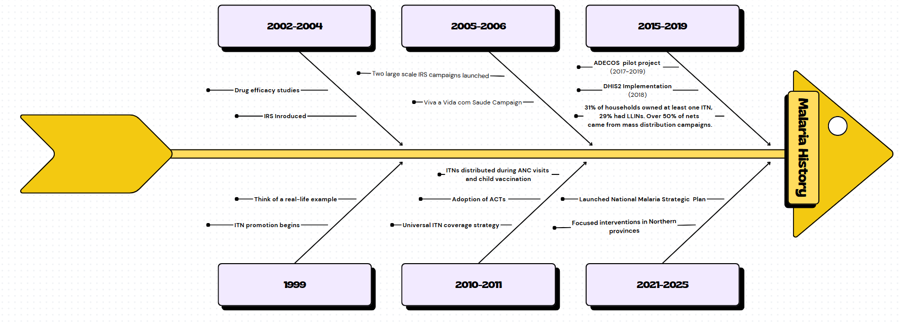
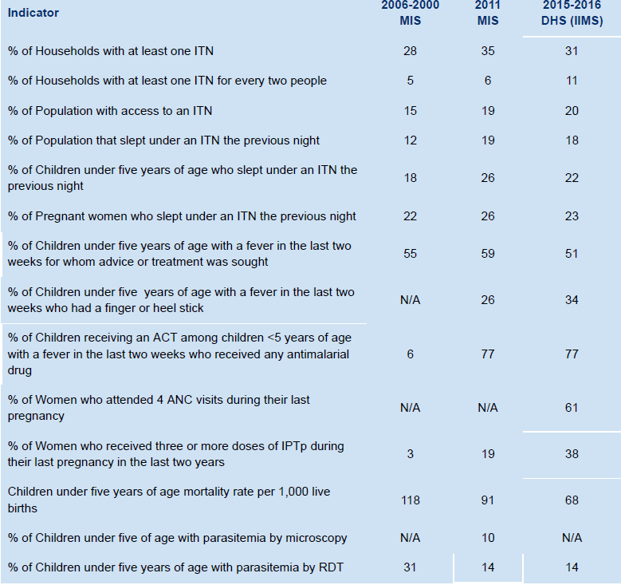
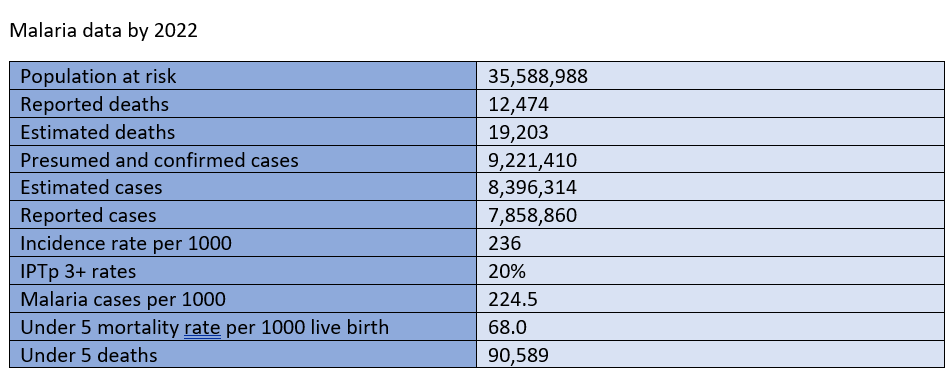

```{r, echo=FALSE, out.width='20%', fig.align='right'}
knitr::include_graphics("logos/map_logo.png")

```

------------------------------------------------------------------------

### **ANGOLA MALARIA EPIDEMIOLOGY PROFILE**

*Author*: Sarah Leonard

------------------------------------------------------------------------

```{r, echo = FALSE, message=FALSE, warning=FALSE}
knitr::opts_chunk$set(
  echo = FALSE,
  warning = FALSE,
  message = FALSE,
  include = TRUE,
  fig.align = 'center',
  out.width = '100%'
)
```

```{r, echo = FALSE, message=FALSE, warning=FALSE}

#  
# install.packages("tidyverse")
# install.packages("imager")
# install.packages("plotly")
# install.packages("rnaturalearth")
# install.packages("rnaturalearthdata")
# install.packages("raster")
# install.packages("elevatr")
# install.packages("ggspatial")
# install.packages("leaflet")
# install.packages("kableExtra")
# install.packages("malariaAtlas")
# install.packages("janitor")
# install.packages("gt")
```

```{r, echo = FALSE, message=FALSE, warning=FALSE}
library(raster)
library(leaflet)
library(tidyverse)
library(knitr)
library(ggplot2)
library(dplyr)
library(sf)
library(imager)
library(rnaturalearth)
library(rnaturalearthdata)
library(ggspatial)
library(plotly)
library(RColorBrewer)
library(elevatr)
library(viridisLite)
library(kableExtra)
library(janitor)
library(malariaAtlas)
library(gt)

```

#### **Introduction**

Angola is the seventh-largest country in Africa found on the West-Central Coast of Southern Africa covering 1,246,699 square kilometers. It shares borders with Namibia to the South, Democratic Republic of Congo (DRC) to the North, Zambia to the East and Atlantic ocean to the West.It is a Lusophone (Portuguese-speaking) Nation. Administratively according to Law No. 18/16 of October 17,2016 the country is divided into 18 provinces, 164 districts, 518 communes and 44 urban districts, with Luanda serving as its capital city. It's population is approximately 36.7 million as of 2023 (WHO), where two third of population lives in urban areas and one third in rural areas.

Angola's health landscape is dominated by endemic, communicable and parasitic diseases such as malaria, HIV/AIDS, and tuberculosis. And malaria remains the leading cause of mortality and morbidity [AMIS 2011](https://dhsprogram.com/pubs/pdf/mis2/mis2.pdf).

```{r, echo = FALSE, message=FALSE, warning=FALSE}

# Download shapefile for angola
angola <- ne_countries(scale = "medium", country = "Angola", returnclass = "sf")

#shapefile from malariaAtlas
Ang <- getShp(country = "Angola", admin_level = c("admin1"))

# Download angola's regions shapefile
angola_province <- ne_states(country = "Angola", returnclass = "sf")

# #Download angola's rainfall data for timeseries to date.
# ang_rainfall <- read_csv("C:/Users/Admin/Desktop/MAP/ANG/ago_rainfall_5ytd.csv", skip =1) %>% 
#   janitor::clean_names()
# 
# #cleaning column names
# ang_rainfall <- clean_names()
# 


# ang_rainfall <- ang_rainfall %>%
#   mutate(date = as.Date(number_date),
#          month = floor_date(date, "month"))
# 
# 


# # Monthly average by region
# monthly_region <- ang_rainfall %>%
#   group_by(month, number_adm2_id) %>%
#   summarise(avg_rhf = mean(number_indicator_rfh_num, na.rm = TRUE), .groups = "drop")
# 
# # Pick 5 example regions
# top_adm2 <- unique(monthly_region$number_adm2_id)[1:5]
# 
# # Filter for plotting
# subset_monthly <- monthly_region %>%
#   filter(number_adm2_id %in% top_adm2)
# 
# ggplot(subset_monthly, aes(x = month, y = avg_rhf, color = as.factor( number_adm2_id))) +
#   geom_line() +
#   labs(title = "Monthly Average Rainfall for Selected Admin2 Regions",
#        x = "Month", y = "Rainfall (mm)", color = "Admin2 ID") +
#   theme_minimal() +
#   scale_x_date(date_labels = "%Y-%m", date_breaks = "6 months") +
#   theme(axis.text.x = element_text(angle = 45, hjust = 1))
# 
# 
# 
# 
# 


#Create a data frame for Luanda (Capital City)
capital_city <- data.frame(name = "Luanda", lon = 13.2894, lat = -8.8383)
capital_city_sf <- st_as_sf(capital_city, coords = c("lon", "lat"), crs = 4326)
#capital_city_sf <- st_transform(capital_city_sf, crs = crs(angola_elev))


#creating Angola map

ggplot(data = Ang)+
  geom_sf(data = angola, fill = "white", color = "black", size = 0.5) +
  geom_sf(aes(fill = name_1), color = "black")+
  geom_sf_text(aes(label = name_1), size = 3, color = "black")+
  geom_sf(data = capital_city_sf, color = "blue", size = 3, shape = 16) +
  annotate("text", x = 13.2894, y = -8.8383, label = "", 
           hjust = -0.1, color = "blue", fontface = "bold", size = 4) +
  coord_sf() +
  scale_fill_brewer(palette = "Set3") +
                 theme_minimal()+
                 theme(legend.position = "none", plot.title = element_text(hjust = 0.5),
                       axis.text = element_blank(),
    axis.ticks = element_blank(),
    axis.title = element_blank(),
    panel.grid = element_blank())


# # --- Step 2: Load local shapefile (e.g., waterbodies) ---
# # Replace this path with your own water body shapefile for Angola
# local_waterbodies <- st_read("C:/Users/Admin/Downloads/Water_Supply/Water_Supply_Control-Rivers.shp", quiet = TRUE)
# 
# # --- Step 3: Ensure geometries are valid ---
# local_waterbodies <- local_waterbodies[st_is_valid(local_waterbodies), ]
# 
# # --- Step 4: Crop waterbodies to Angola boundaries ---
# local_waterbodies_angola <- st_intersection(local_waterbodies, Ang)
# 
# # --- Step 5: Define Bounding Box around Angola (customize if needed) ---
# bbox <- st_bbox(c(xmin = 11, ymin = -18, xmax = 24, ymax = -4), crs = st_crs(Ang))
# bbox_sf <- st_as_sf(st_sfc(st_polygon(list(matrix(c(
#   bbox["xmin"], bbox["ymin"], 
#   bbox["xmin"], bbox["ymax"], 
#   bbox["xmax"], bbox["ymax"], 
#   bbox["xmax"], bbox["ymin"], 
#   bbox["xmin"], bbox["ymin"]
# ), ncol = 2, byrow = TRUE))), crs = st_crs(Ang)))
# 
# # --- Step 6: Plot ---
# ggplot() +
#   geom_sf(data = Ang, fill = "lightgray", color = "black") +
#   geom_sf(data = local_waterbodies_angola, fill = "blue", color = NA, alpha = 0.5) +
#   geom_sf(data = bbox_sf, fill = NA, color = "red", linetype = "dashed") +
#   theme_minimal() +
#   labs(title = "Water Bodies in Angola with Admin Boundaries",
#        subtitle = "Clipped to Admin Level 1 and Custom Bounding Box")
# 


```

The country has a high fertility rate, it is the second highest in Africa and one of the highest in the world with around 6 children per woman (2018) [National Institute of Statistics of Angola]. This impacts on malaria control due to high demand for antenatal services [@Malariacasemanagement:operations manual,WHO 2019]

```{r}
#creating data for population change over years.

angola_pop <- data.frame(Age_group = c("Total","0-4 years", "5-14 years", "15+ years"),
          `2021` = c(32097671, 5155975, 9416387, 17525309),
          `2022` = c(33086278, 5299939, 9559112, 18227227),
          `2023` = c(34094077, 5431240, 9697760, 18965077),
          `2024` = c(35121734, 5549133, 9832392, 19740209),
          `2025` = c(36170961, 5663200, 9955179, 20552582))


# Define formatting function
table_formatting <- function(x) {
  x %>%
    kable_styling(bootstrap_options = c("striped", "hover", "condensed"),
                  font_size = 12,
                  position = "center",
                  full_width = TRUE) %>%
    column_spec(1, bold = TRUE, color = "black", background = "#DAA520") %>%
    column_spec(2, background = "gray", color = "white")
}

# Apply formatting to kable
table_formatting(
  kable(angola_pop, caption = "Angola Population by Age Group (2021–2025)")
)


```

### History of malaria.

During colonial times, quinine was used, later replaced by chloroquine in the 1950s. By the late 1970s, drug resistance to chloroquine emerged and by the early 2000s, artemisinin-based combination therapies (ACTs) were introduced, becoming the first-line treatment by 2007/2008. Below is a series of events occurred from 1999 .

Malaria remains one of the most pressing public health concerns in Angola, particularly affecting vulnerable populations such as young children and pregnant women. In 2004 alone, the country recorded approximately 3.2 million malaria cases, with children under the age of five accounting for nearly two-thirds of these infections. The estimated number of malaria-related deaths that year was around 38,000. Malaria is responsible for a significant proportion of child mortality, contributing to an estimated 35% of deaths among children under five, as well as 60% of hospitalizations in this age group. Additionally, the disease accounts for about 10% of hospital admissions among pregnant women [(Ruebush et al., 2005)].

Efforts to control malaria in Angola have a long history, beginning in 1958 with the introduction of residual insecticide spraying in the southern regions. A notable pilot intervention was carried out in Benguela province in 1970. The establishment of the National Malaria Control Program (NMCP) in 1984, with technical support from the World Health Organization (WHO), marked a more structured national response to malaria. Over the years, Angola has endorsed several international malaria control initiatives, including the 1992 Global Malaria Control Strategy and the 1997 African Initiative to Accelerate the Fight Against Malaria. Further commitments were made through agreements signed in 1998, 1999, and 2000.

It was not until 2001 that the Angolan government began allocating specific budgetary resources and designing targeted malaria programs. In 2002, the government elevated the disease to national priority status by establishing the National Commission to Combat HIV/AIDS, Malaria, and Tuberculosis, thereby reaffirming its commitment to coordinated disease control (NMCP, 2005).[Angola 2006-07](https://dhsprogram.com/pubs/pdf/MIS2/MIS2.pdf)

```{r, echo = FALSE, message=FALSE, warning=FALSE}


# links that has some information of the chart
#https://malariajournal.biomedcentral.com/articles/10.1186/s12936-022-04424-y
#https://malariajournal.biomedcentral.com/articles/10.1186/s12936-017-1843-7
#https://malariajournal.biomedcentral.com/articles/10.1186/s12936-020-03338-x

```

#### **Malaria Transmission**

According to World Malaria Report 2022 the transmission of malaria in Angola accounts for 3.4% of global malaria cases and 2.4% of global malaria deaths. Within the central African region, Angola recorded the second highest (15%) malaria cases. Malaria was responsible for 44% of all reported death is in 2022, rising from 42% in 2021.([PMI Angola profile 2023](https://mesamalaria.org/wp-content/uploads/2025/04/ANGOLA-Malaria-Profile-PMI-FY-2024-1.pdf))

The country experiences nationwide transmission with various ecological regions having different transmission intensities due to geographical and climatic variations. The central and coastal provinces (Benguela, Bie, Cuanza Sul, Huambo, Luanda, Moxico and Zaire) are mosoendemic with stable transmission. The four southern provinces bordering Namibia have highly seasonal transmission and are prone to epidemics.

In the north the peak malaria transmission season extends from march to may with a secondary peak in October to November. Since the rainfall duration ranges from about three months in Cunene Province to eight or nine months (October to April or May) in Northern and eastern Angola.

In Angola there is significant geographical heterogeneity in malaria transmission. The malaria prevalence rate among children less than five years of age remained stable (around 14 percent) from 2011 (Angola 2011 Malaria Indicator Survey [MIS]) to 2015–2016.([DHS 2015-2016](https://dhsprogram.com/pubs/pdf/MF19/MF19.pdf)).

```{r,echo = FALSE, message=FALSE, warning=FALSE}

# Assign malaria transmission zones
angola_province$name <- case_when(
  angola_province$name %in% c("Cabinda", "Cuanza Norte", "Lunda Norte", "Lunda Sul", "Malanje", "Uíge","Bengo") ~ "Hyperendemic",
  angola_province$name %in% c("Benguela", "Bié", "Cuanza Sul", "Huambo", "Luanda", "Moxico", "Zaire") ~ "Mesoendemic",
  angola_province$name %in% c("Namibe", "Huíla", "Cunene", "Cuando Cubango") ~ "Seasonal",
  TRUE ~ NA_character_
)

# Plot the malaria transmission map
ggplot(angola_province) +
  geom_sf(aes(fill = name), color = "white") +
  scale_fill_manual(values = c(
    "Hyperendemic" = "#e74c3c",
    "Mesoendemic" = "#f1c40f",
    "Seasonal" = "#3498db"
  ), na.value = "grey90", name = "Malaria Transmission") +
  labs(title = "Malaria Transmission in Angola") +
  theme_minimal() +
  theme(
    plot.title = element_text(hjust = 0.5, face = "bold", size = 16),
    legend.position = "right",
    axis.text = element_blank(),
    axis.ticks = element_blank(),
    panel.grid = element_blank()
  )


```

### **Health system tiers**

Health services in Angola are organized through an integrated four-tier system, with malaria prevention and treatment addressed at all levels, including the community. As of 2019, data from the Statistics Department of the Office of Studies, Planning, and Statistics (GEPE) reported a total of 2,793 health facilities across the country, distributed by type as shown in Table 4.

These health units are managed by different levels of government. In addition to facility-based services, community health care is delivered by Community Health Agents (ADECOS), who operate within geographically defined areas established by the Ministry of Territorial Administration (MAT). Each ADECOS typically covers 50 to 100 households, serving an estimated population of 270 to 540 people.

As of July 2020, a total of 2,682 ADECOS were registered in 94 municipalities across Angola's 18 provinces. Of these, 1,185 were actively involved in the management of malaria cases at the community level.[Angola NSP]

The schematic system of health reporting in Angola is categorized into three levels;

-   Level 1: health posts, health centres, maternal and child health centres, municipal hospitals, and general healthcare facilities.
-   Level 2: General provincials hospitals.
-   Level 3: central and speciality hospitals

#### **Health care systems**

Angola's health care systems is coordinated by the Ministry of Health (MOH) and consists of four main types of services; public, for profit, non-profit and traditional healthcare services. Currently, only about 44.6% of the population has access to fixed health services [PNDS 2021-2025].

-   Public health system: Managed by the MOH, providing essential services to the majority of the population.
-   Private sector: Predominantly concentrated in urban and peri-urban areas, where public health services may be limited or absent. This sector is regulated by the General Health Inspection Department.
-   Traditional: Plays an important role in healthcare, particularly in rural areas.

The National Health Services (NHS) operates within a hierarchical framework, with services provided at the following levels:

1.  Central level: At the national level, overseeing overall healthcare strategy and policy.
2.  Provincial level: Regional management of healthcare, providing specialized care.
3.  Municipal level: Local healthcare services within towns and districts.
4.  Community level: Basics accessible healthcare at the grassroots level through health posts and community health workers.

Decision making in health planning and budgeting in Angola primarily occurs at the provincial and national levels, despite existence of tools like Municipal Planning and Budgeting Tool (FPOM) guiding the municipal-level planning it still limited to decentralization since they don't report to health sector (GPS or GEPE) rather to municipal administrations.

The planning process is decentralized at the municipal level, but lacks a formal mechanism to ensure systematic intergration of annual plans (POAs). As a result planning is often fragmented, with only general guidance to align with the PNDS and the PDN 2018-2022.

```{r,echo = FALSE, message=FALSE, warning=FALSE}

#knitr::include_graphics("ANG/healthcare.png")

library(knitr)
library(kableExtra)

# Data for the table
data <- tribble(
  ~Category,                                      ~Value,
  "Health facilities by levels",              "",
  "Primary level",                                "3,099 HFs",
  "Secondary level",                              "50 HFs",
  "Tertiary level",                               "14 HFs",
  "Health facilities by types",               "",
  "National hospitals",                           "15",
  "Central and specialty hospitals",              "32",
  "Provincial hospitals",                         "18",
  "Health care workers for population",       "",
  "Physicians",                                   "5,610",
  "Nurses",                                       "40,006",
  "Health care workers per 10,000",           "",
  "Medical doctors",                              "1.69",
  "Nurses",                                       "12.09"
)

# Render the table
kable(data, col.names = NULL, align = c("l", "r")) %>%
  kable_styling(full_width = FALSE, position = "left") %>%
  row_spec(which(grepl("\\*\\*", data$Category)), bold = TRUE, background = "#C1440E", color = "white") %>%
  row_spec(1, background = "#8B2500", color = "white") %>%
  row_spec(5, background = "#D2691E", color = "white") %>%
  row_spec(9, background = "#F4A460", color = "black") %>%
  row_spec(12, background = "#FFE4B5", color = "black")


```

#### **Malaria data.**

Angola has made significant progress in strengthening its malaria reporting system over the years. Until 2017, the country relied primarily on paper-based reporting. Subsequently, digital tools were introduced leading to the adoption of the District Health Information Software 2 (DHIS2) as the national platform for malaria data reporting and management.

It implemented the DHIS2 digital health information system in 2018 to strengthen malaria case detection, situation reporting, and active surveillance. Since then, reporting rates have improved significantly across supported municipalities, highlighting the system’s effectiveness. The DHIS2 platform is now operational nationwide and collects a range of key malaria indicators, including the number of suspected malaria cases, the number of individuals tested, and the number of confirmed positive cases. The system also dis-aggregates data by age groups—such as children under five and adults—to support targeted interventions. It captures data reported by community health workers (CHWs), including the number of patients tested and treated for malaria at the community level. These improvements have enhanced Angola’s capacity to monitor malaria trends, support timely response, and guide resource allocation at both facility and community levels.

With the shift from paper-based reports to digital platforms like the District Health Information Software Version 2 (DHIS2) supported by PMI, malaria monthly report completeness rates have increased nationwide from 82 percent in 2017 to 92.1 percent in 2022, while the timely reports rate improved from 55 percent in 2017 to 80.5 percent in 2022[AMR 2023].

**Key survey Indicators**

```{r}

#


# Load necessary libraries
library(tibble)
library(gt)

# Create the table as a tibble
malaria_data <- tibble(
  Indicator = c(
    "% of Households with at least one ITN",
    "% of Households with at least one ITN for every two people",
    "% of Population with access to an ITN",
    "% of Population that slept under an ITN the previous night",
    "% of Children under five years of age who slept under an ITN the previous night",
    "% of Pregnant women who slept under an ITN the previous night",
    "% of Children under five with fever in the last 2 weeks for whom treatment was sought",
    "% of Children under five with fever in the last 2 weeks who had a finger or heel stick",
    "% of Children <5 receiving ACT among those who received any antimalarial",
    "% of Women who attended 4 ANC visits during last pregnancy",
    "% of Women who received ≥3 doses of IPTp during last pregnancy",
    "Under-five mortality rate (per 1,000 live births)",
    "% of Children under five with parasitemia by microscopy",
    "% of Children under five with parasitemia by RDT"
  ),
  `2000-2006 MIS` = c(28, 5, 15, 12, 18, 22, 55, NA, 6, NA, 3, 118, NA, 31),
  `2011 MIS` = c(35, 6, 19, 19, 26, 26, 59, 26, 77, NA, 19, 91, 10, 14),
  `2015–2016 DHS (IIMS)` = c(31, 11, 20, 18, 22, 23, 51, 34, 77, 61, 38, 68, NA, 14)
)

# Format the table using gt
malaria_data %>%
  gt() %>%
  tab_header(
    title = "Key Malaria Indicators in Angola") %>%
  fmt_missing(
    columns = everything(),
    missing_text = "N/A"
  ) %>% 
  tab_style(
    style = cell_fill(color = "#d9eaf7"),
    locations = cells_body(columns = everything())
  ) %>%
  tab_style(
    style = list(
      cell_fill(color = "#2f75b5"),
      cell_text(color = "white", weight = "bold")
    ),
    locations = cells_column_labels(columns = everything())
  )  %>%
  tab_source_note(
    source_note = "Source: President's Malaria Initiative (PMI) 2023")

```

```{r}

#
library(gt)

# Create data
malaria_data <- data.frame(
  Indicator = c(
    "Population at risk",
    "Reported deaths",
    "Estimated deaths",
    "Presumed and confirmed cases",
    "Estimated cases",
    "Reported cases",
    "Incidence rate per 1000",
    "IPTp 3+ rates",
    "Malaria cases per 1000",
    "Under 5 mortality rate per 1000 live birth",
    "Under 5 deaths"
  ),
  Value = c(
    "35,588,988",
    "12,474",
    "19,203",
    "9,221,410",
    "8,396,314",
    "7,858,860",
    "236",
    "20%",
    "224.5",
    "68.0",
    "90,589"
  )
)

# Create a styled table
malaria_data %>%
  gt() %>%
  tab_header(
    title = "Malaria data by 2022"
  ) %>%
  cols_label(
    Indicator = "",
    Value = ""
  ) %>%
  tab_style(
    style = cell_fill(color = "#c9dbf0"),
    locations = cells_body()
  ) %>%
  tab_style(
    style = cell_text(weight = "bold", color = "white"),
    locations = cells_column_labels()
  )


```

#### **Climate Dirvese and Topography**

There are two seasons: a dry season and a cold season. The dry season, known as “cacimbo”, which officially runs from 15 May to 15 August, can begin in June and last until September. The hot season, with lots of rain and precipitation, can last from October to April or May [1](NMSP 2021-2025).

The country encompasses both the southern edge of subtropical humid regions of Africa in the north of the country, with tropical and subtropical forests and the northern edge of the Namib Desert in Angola's southwest with arid areas of desert and steppe along its coastal and southern edges. Mayombe forest is the largest forest in Africa, spreads throughout Angola's NW province of Cabinda as well as regions of the DRC, RoC and Gabon fed by the Congo river,the second longest in Africa. In the interior, Mount Moco Angola's highest mountain (peak at 2620m)is located in Huambo province.

The variation in rainfall (highest in the NE, along the border with the DRC, and lowest in the xeric SW), temperature, altitude and biome in turn affect the availability of suitable breeding grounds for the mosquitoes vectors. In addition to rainfall, providing habitats for mosquito larvae, temperature (and possibly its fluctuations) are key factors in determining malaria transmission intensity.([Malaria Journal](https://malariajournal.biomedcentral.com/articles/10.1186/s12936-022-04424-y))


```{r, echo = FALSE, message=FALSE, warning=FALSE}
knitr::include_graphics("ANG/angola_climate.webp")


```

#### **Malaria vectors**

The presence of vector species is the key determinant of malaria transmission, this is constrained by environmental suitability. The difference in rainfall,altitude , weather patterns,flora and fauna are all interact in habitability for Anopheles mosquitoes, and this influence the prevalence and burden of malaria across the country.

The primary malaria vectors in Angola belong to the Anopheles gambiae species complex, notably *An.gambiae sensu stricto (s.s)*, *An.arabiensis* and *An.melas* as well as *Anopheles funestus*. The geographic distribution of these species is notably heterogenous. Among them, *An. gambiae s.s* and *An. funetus* are most widely distributed. *An.gambiae s.s* is most prevalent in the forested highlands of the northern provinces, including Zaire, Malanje and Uige while *An.funestus* is more dominant in the central, southern and some coastal areas. *An.melas* is commonly found along the coastal regions, whereas *An.arabiensis* and *An.pharoensis* are more frequently reported in the sourthern and central highland provinces such as Huambo, Benguela, Cunene, Huila and Namibe. Though *An.pharoensis* and *An. coustani* are considered minor contributors to malaria transmission but are recognized as secondary vectors ([Malaria Journal](https://malariajournal.biomedcentral.com/articles/10.1186/s12936-022-04424-y))

```{r,echo = FALSE, message=FALSE, warning=FALSE}

knitr::include_graphics("ANG/vector_distribution.webp")

```

#### **Malaria stratification**

The National Malaria Strategic Plan (NMSP) 2021-2025 features an updated district-level malaria risk stratification, based on routine incidence data and prevalence estimates from the 2015-2016 Demographic and Health Survey (DHS) and the 2018 mini Malaria Indicator Survey (MIS).This stratification supports evidence-based planning by guiding the selection and implementation of tailored intervention packages for each risk level in line with national malaria control objectives.([PMI Angola profile 2023](https://mesamalaria.org/wp-content/uploads/2025/04/ANGOLA-Malaria-Profile-PMI-FY-2024-1.pdf))

```{r, echo = FALSE, message=FALSE, warning=FALSE}

knitr::include_graphics("ANG/malaria_stratification.png")

```
```{r}
# library(ggplot2)
# 
# ggplot(ang_rainfall, aes(x = date, y = rfh_avg, group = date, color = as.factor(date()))) +
#   geom_line() +
#   #facet_wrap(~ Province) +
#   labs(
#     title = "Monthly Rainfall Trends in Angola (Past 5 Years)",
#     y = "Rainfall (mm)", x = "Month",
#     color = "Year"
#   ) +
#   theme_minimal()


```


#### **References**

1.  President's Malaria Initiative Malaria Operational Plan: Angola 2022
2.  [Severe Malaria Observatory](https://www.severemalaria.org/countries/angola/healthcare-system)
3.  CMI REPORT, R2011:9
4.  <https://malariajournal.biomedcentral.com/articles/10.1186/s12936-022-04424-y>
6.  [WHO Country data](https://data.who.int/countries/024)
7.  <https://www.afro.who.int/sites/default/files/2023-08/Angola.pdf>
8.  Ministry of Health(MOH)
9.  [Plasmodium falciparum drug resistance](https://malariajournal.biomedcentral.com/articles/10.1186/s12936-016-1122-z)
10. VER ANGOLA
11. <[Angola 2006-07](https://dhsprogram.com/pubs/pdf/MIS2/MIS2.pdf)>
12. <https://dhsprogram.com/pubs/pdf/SR238/SR238.pdf>
13. <https://dhsprogram.com/pubs/pdf/MIS11/MIS11.pdf>
14. [AMIS 2011] (Angola Malaria indicator survey 2011 [MIS11]
15. <https://dhsprogram.com/pubs/pdf/MF19/MF19.pdf> -Angola DHS 2015-16 Malaria Fact
16. https://malariajournal.biomedcentral.com/articles/10.1186/s12936-017-1843-7
17. https://www.researchgate.net/publication/366644916_Malaria_in_Angola_recent_progress_challenges_and_future_opportunities_using_parasite_demography_studies
