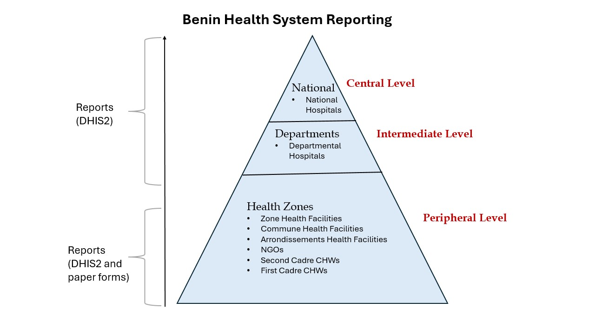
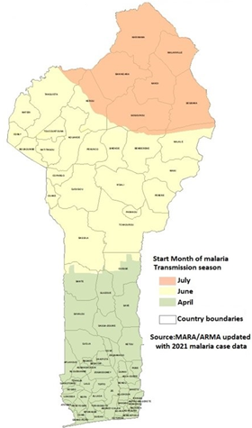
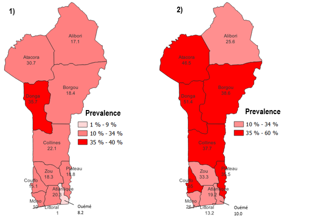

```{r, echo=FALSE, out.width='20%', fig.align='right'}
knitr::include_graphics("logos/map_logo.png")

```

---


### **Benin Malaria Epidemiology Summary**


---


#### **Introduction**

Benin, located in West Africa, is bordered by Togo to the west, Nigeria to the east, Burkina Faso and Niger to the north, and the Atlantic Ocean to the south. The country had a population of approximately 13.7 million people in 2022 (_Demographics of Benin, Wikipedia_), and the official language is French. Malaria is endemic in Benin and remains the leading cause of mortality among children under five and a significant cause of morbidity among adults.

#### **Administrative Boundaries**

Benin is divided into 12 departments and subdivided into 77 communes, the communes are further subdivided into 546 arrondissements (districts) composed of 5295 villages and town neighborhoods. The administrative and health systems overlap at the departmental level, with health zones serving as the primary units for implementing national health development programs and projects.

```{r, echo = FALSE, message=FALSE, warning=TRUE}
# Import libraries.
library(sf)
library(ggplot2)
library(ggthemes)
library(ggspatial)
# Load the shape file of Benin map.
ben <- st_read("BNN/BEN-ADM01/geoBoundaries-BEN-ADM1.shp", quiet = TRUE)
lakes <- st_read("BNN/Water/hotosm_ben_waterways_polygons_shp.shp",  quiet = TRUE)
prot_areas <- st_read("BNN/ProtectAreas/WDPA_WDOECM_Jan2025_Public_12201_shp-polygons.shp",  quiet = TRUE)
```
```{r, echo=FALSE, message=FALSE, warning=FALSE}
# Create a data frame for cities
bcities <- data.frame(
  name = c("Porto-Novo", "Cotonou"),
  lon = c(2.6167, 2.4333),
  lat = c(6.4833, 6.3667),
  type = c("Capital City", "Main City")
)
```


```{r, echo=FALSE, message=FALSE, warning=FALSE, out.width="100%"}
# Plot the map
ggplot() +
  # Plot Benin's regions
  geom_sf(data = ben, fill = "#fde0dd", color = "grey", size = 0.3) +
  
  # Plot lakes
  geom_sf(data = lakes, aes(fill = "Lakes/Lagoons"), color = NA, size = 0.2) +
  
  # Plot protected areas
  geom_sf(data = prot_areas, aes(fill = "National Parks"), color = NA, size = 0.2) +
  
  # Add region labels
  geom_sf_text(data = ben, aes(label = shapeName), size = 2.5, 
               color = "black", fontface = "bold", alpha = 0.85) +
  
  # Add national park labels
  geom_sf_text(data = prot_areas, aes(label = NAME), size = 2, 
               color = "darkgreen", fontface = "italic") +
  # Add cities
  geom_point(data = bcities, aes(x = lon, y = lat, fill = type),
             size = 2, shape = 21, color = "black") +
  # Add city labels
  geom_text(data = bcities, aes(x = lon, y = lat, label = name), 
            color = "darkblue", fontface = "italic", size = 1.5, hjust = -0.2) +
  
  # Customize the theme
  theme_map() +
  theme(
    plot.title = element_text(size = 14, face = "bold", hjust = 0),
    plot.caption = element_text(size = 8, face = "italic", hjust = 0),
    plot.subtitle = element_text(size = 12, hjust = 0, color = "darkgrey"),
    plot.background = element_rect(fill = "#EAF2F8", color = NA),
    legend.key.size = unit(0.4, "cm"), 
    legend.position = c(1, 0.2),
    legend.title = element_blank(),
    legend.text = element_text(color = rgb(0,0,0, alpha = 0.8)),
    plot.margin = margin(r = 100),
  ) +
    # Manual scale for legend, combining water bodies, National parks, and cities
  scale_fill_manual(
    values = c(
      "National Parks" = "#83C99F",
      "Main City" = "#A52A2A",
      "Capital City" = "blue",
      "Lakes/Lagoons" = "#5D9FC7"
    )) +
  
  # Add title and subtitle
  labs(
    title = "Geographical Map of Benin",
    subtitle = "Highlighting the Departments",
    caption = "Data Source: Humanitarian Data Exchange & Protected Planet",
    fill = "Legend"
  ) +
  annotation_north_arrow(location = "tr",
                         height = unit(0.8, "cm"),
                         width = unit(0.4, "cm")) +
  annotation_scale(location = "br")


```

#### **Health System Reporting**

Benin's health system is decentralized to the departmental level. Each department has a Departmental Health Directorate (DDS) that supervises and coordinates health activities within the region. It has a pyramidal system with three levels: central, intermediate, and peripheral. The peripheral level includes 34 health zones manged by Health Zone Management Teams (EZS) that coordinates services across primary healthcare centers and district hospitals. The intermediate level, consisting of 12 departments, coordinates between the central and peripheral levels. The central level plays a strategic role in designing health policies and overseeing their execution, with the National University Hospital Center at the top of the healthcare infrastructure.

Healthcare service in Benin is provided by both public and private institutions. Currently, there are total of about 1,800 health facilities which includes hospitals and health centres. Private health sector is a prominent player in the provision of health services and is growing rapidly. The details on percentage of service delivered by private providers is not available, however, out-of-pocket spending suggests that many private transactions are occurring (World Bank, 2010).  

According to the country policy, there are two cadres of community health workers (CHWs). The first one (RCs), which conduct home visits and behavior change activities. RCs refer febrile children to the second cadre of qualified health workers (nurses and midwives) who diagnose and treat malaria. Currently, there are total of 1,474 CHWs, however, only 36 provide malaria test and treatment services ([global community health](https://dashboards.endmalaria.org/en/global-community-health)).

```{r echo=FALSE, out.width="100%"}

```

#### **Types of Malaria Data**
National Health Management System in Benin adopted the DHIS2 since 2015 for handling health data including malaria cases. Health facilities submit their reports to the health zone central office (ZS statistician) to be entered into DHIS2. Community health workers (CHWs) report to their NGOs, and then the data is shared with ZS statistician who enters into DHIS2. Only data for children under 5 years of age are reported by CHWs as highlighted in the table below. The routine health system collects the following malaria indicators data;

```{r echo=FALSE, out.width="100%"}
knitr::include_graphics("BNN/rdata.jpg")
```

Like other countries, Benin has gathered data on malaria prevalence, treatment and prevention through Demographic Health Surveys (DHS), Malaria Indicator Surveys (MIS), Malaria Indicator Cluster Surveys (MICS), and behaviors on prevention and treatment through the Malaria Behavior Survey (MBS).

```{r echo=FALSE, out.width="100%"}
knitr::include_graphics("BNN/sdata.jpg")
```

#### **History of Malaria**
The graphic below illustrates the trend of malaria prevalence in Benin since 2004, alongside significant events that have occurred. The prevalence values are based on data from Demographic and Health Surveys (DHS) and Malaria Indicator Surveys (MIS). Additionally, the country has implemented four National Malaria Strategic Plans (NMSPs) at varying intervals.

```{r echo=FALSE, out.width="100%"}
knitr::include_graphics("BNN/MHist.png")
```

#### **Weather and Seasonality**

Malaria transmission in Benin is stable but varies seasonally and geographically due to climate, rainfall, and topography. The country has three main regions: the southern coastal zone with lakes, lagoons, and a sub-equatorial climate featuring two rainy and two dry seasons; the central plateau with a Sudan-Guinea climate; and the northern hilly area with a Sahelian climate, marked by distinct rainy (May–October) and dry (November–April) seasons. These geo-climatic differences create three malaria transmission zones, as outlined in the National Malaria Strategic Plan 2017-2021:

- Southern zone (heterogeneous transmission) and transmission peaks in April
- Central zone  (holo-endemic transmission) and transmission peaks in June
- Northern zone (seasonal transmission) and transmission peaks in July

```{r echo=FALSE, out.width="50%"}

```


#### **Current Stratification Map**

Currently, there is no publicly available information on the malaria stratification process in Benin. However, we obtained the related maps prepared by [PMI](https://www.pmi.gov/) using data from the 2022 Malaria Indicator Survey (MIS). These maps illustrate malaria prevalence among pregnant women and children under five years of age, as shown below.

```{r echo=FALSE, out.width="100%"}

```
_<br>
**Figure 1** : Malaria prevalence in pregnant women by department.
<br> **Figure 2** : Malaria prevalence in children under 5 by department.
<br> **Source** : U.S President's Malaria Initiative Benin Malaria Profile._

#### **Reference**

1. [PMI malaria operation plans](https://www.pmi.gov/)
2. [Malaria HIS portals](https://malariaportal.org/index.php/country-rhis-profiles)
3. Benin Integrated National Strategic Plan (NSP 2024-2030)
4. [Severe malaria observatory](https://www.severemalaria.org/)
5. [Benin malaria indicator trends](https://dhsprogram.com/pubs/pdf/OD78/OD78.pdf)
6. [Benin country report](https://rad-aid.org/wp-content/uploads/CR_Benin.pdf)
