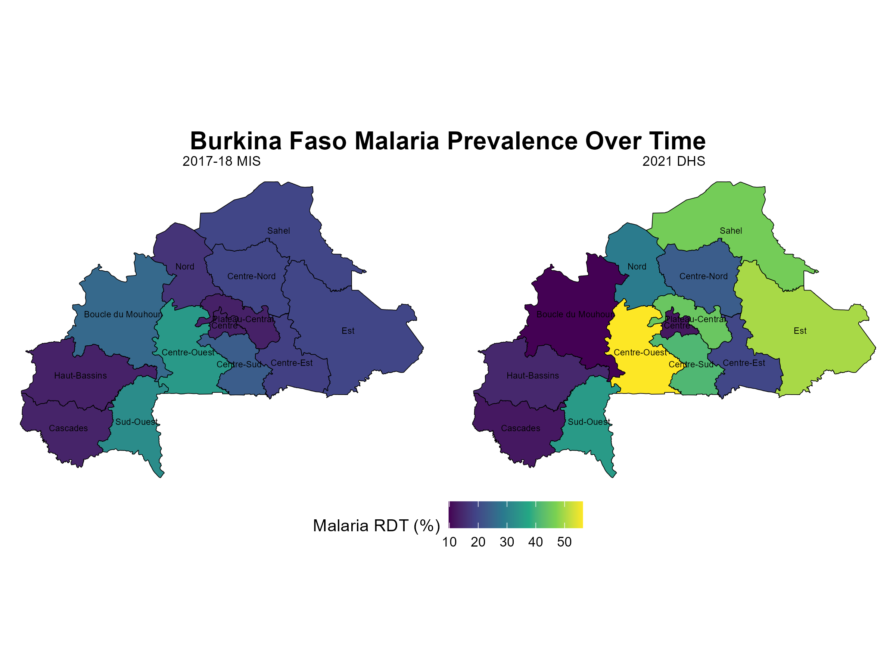
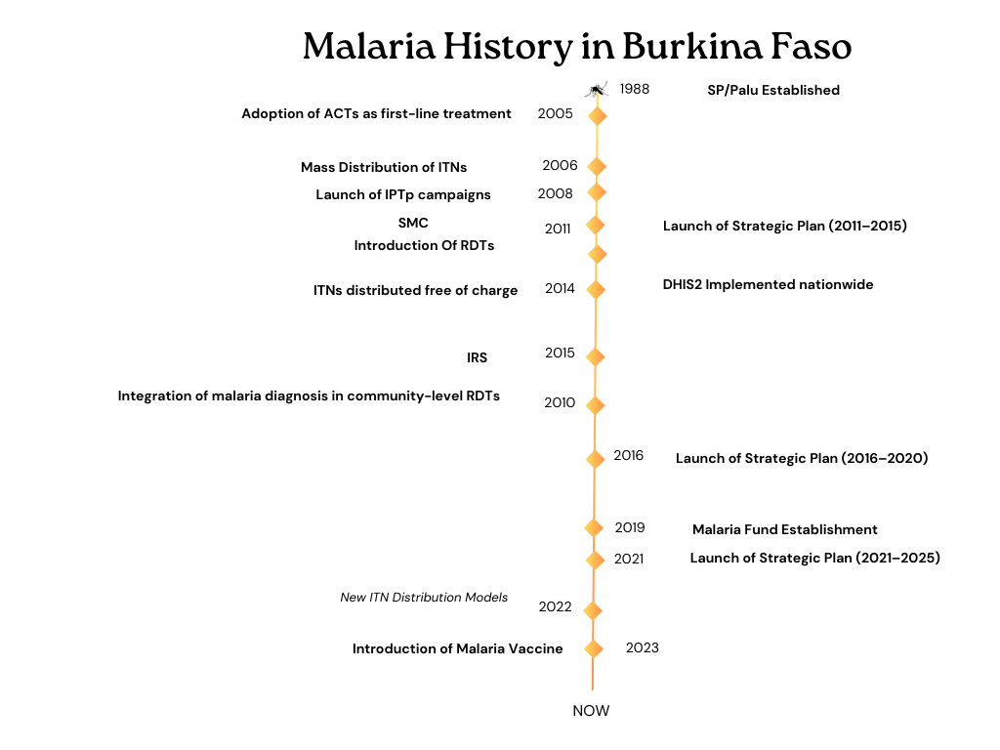
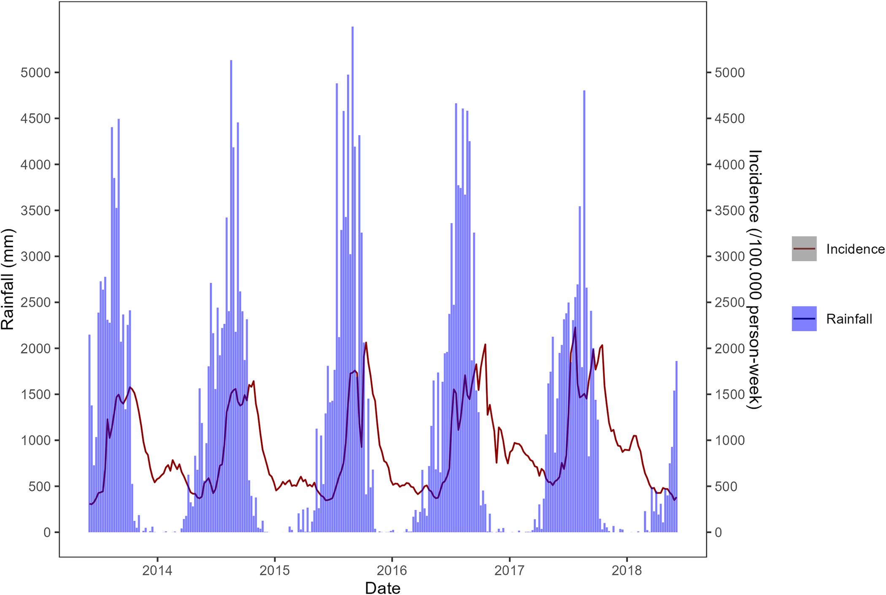
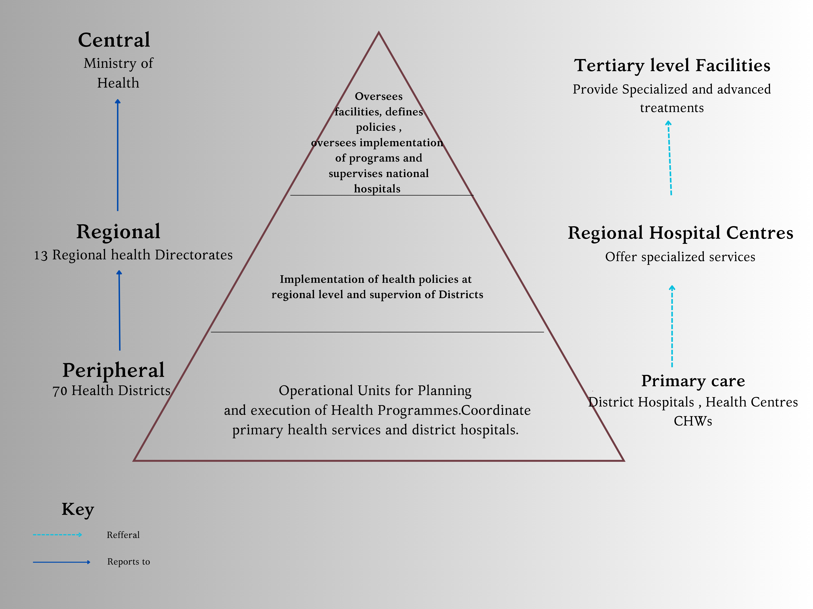
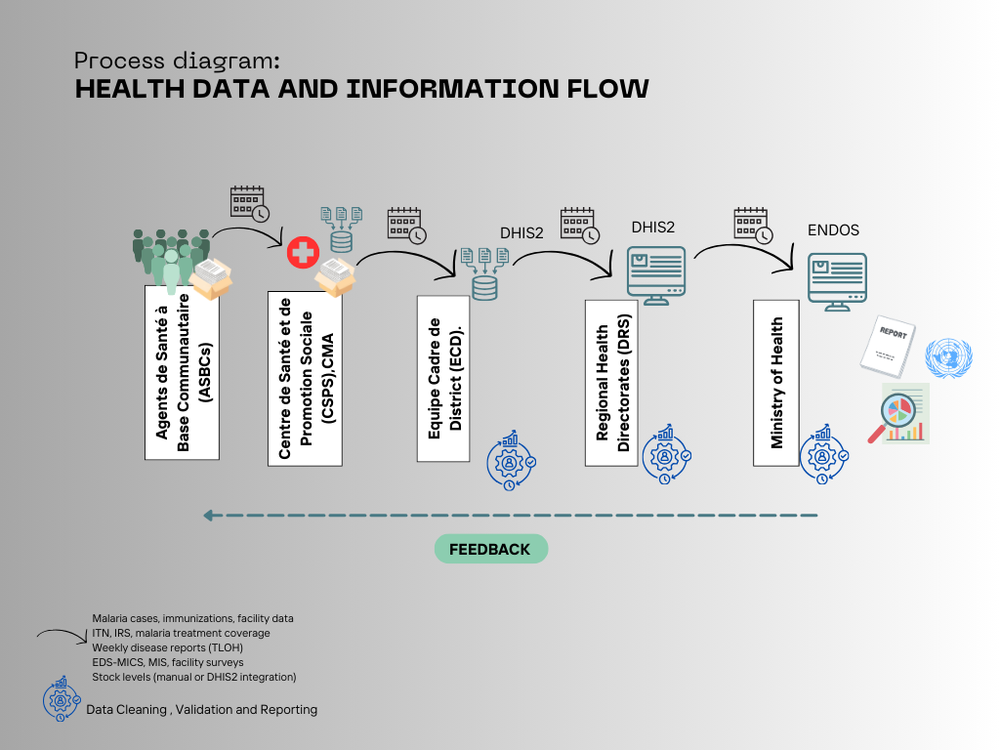
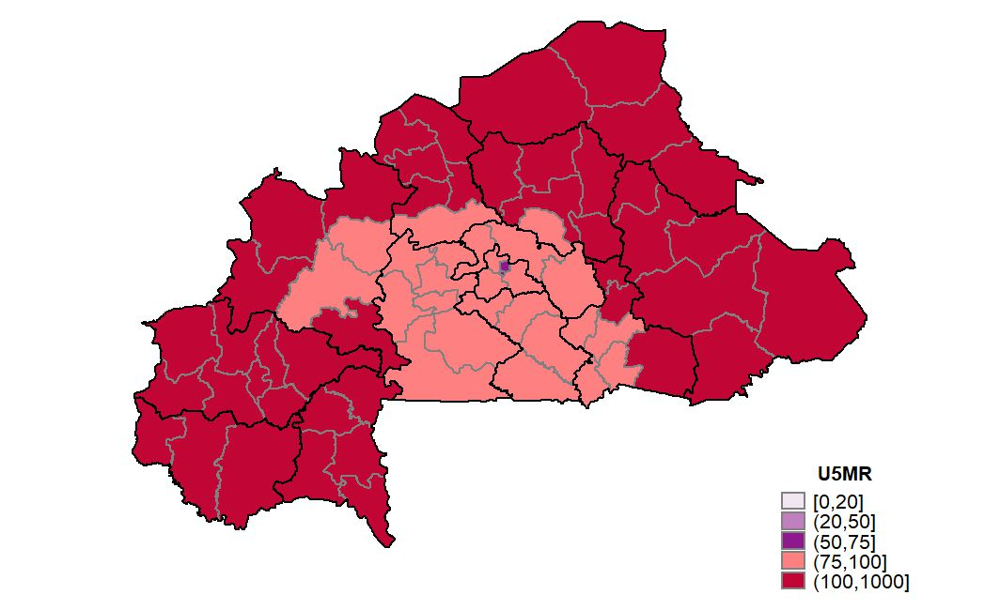
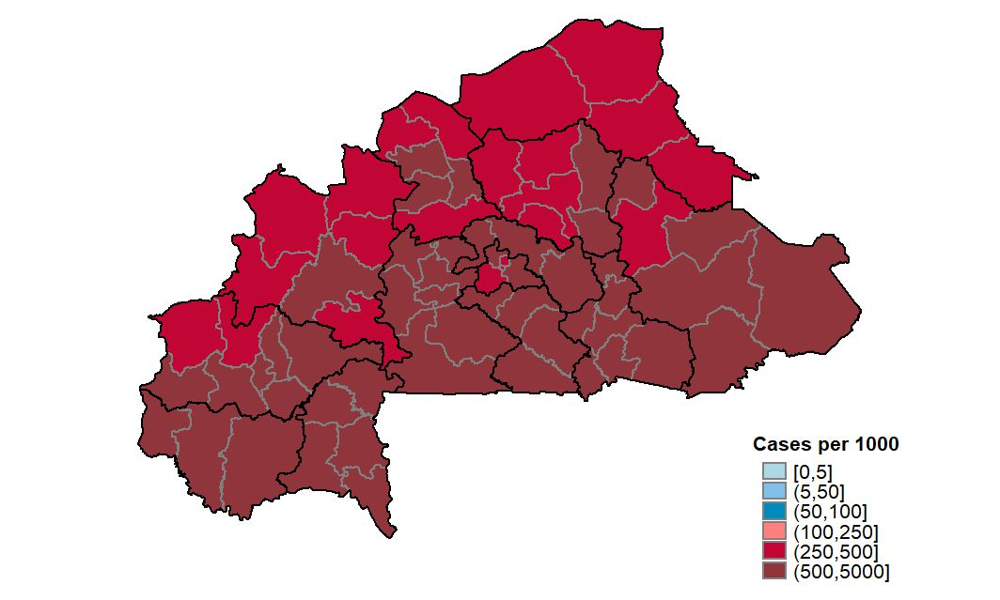
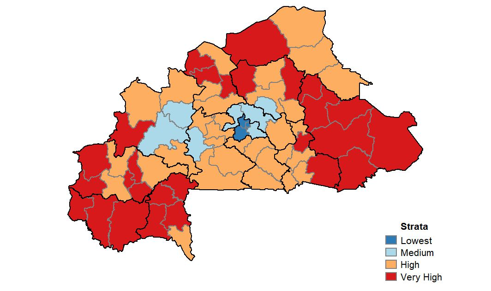
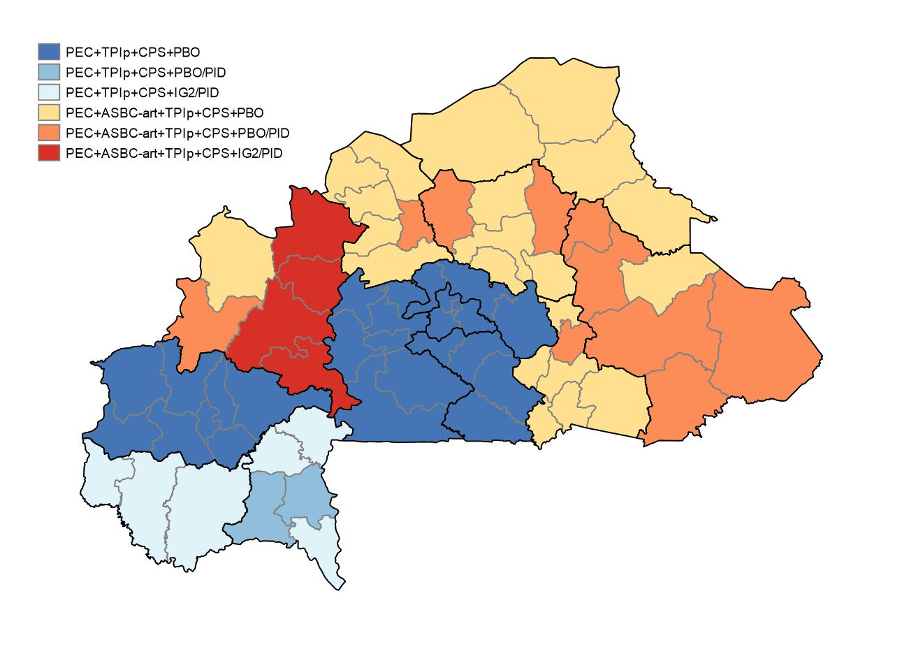

```{r, echo=FALSE, out.width='20%', fig.align='right'}
knitr::include_graphics("logos/map_logo.png")

```

```{r setup,echo=FALSE, warning=FALSE, message=FALSE}

# Create a function to format all tables
table_formatting <- function(x) {
  x %>%
    kable_styling(bootstrap_options = c("striped", "hover", "condensed"),
                  font_size = 12, 
                  position = "center", 
                  full_width = TRUE) %>%
    column_spec(1, bold = TRUE, color = "black", background = "#DAA520") %>%
    column_spec(2, background = "grey", color = "white")
}

# Load the required libraries
library(raster)
library(kableExtra)
library(leaflet)
library(tidyverse)
library(knitr)
library(ggplot2)
library(dplyr)
library(sf)             # For spatial data manipulation
library(rnaturalearth)  # For country shapefiles
library(rnaturalearthdata)
#library(rnaturalearthhires)
library(renv)
library(terra)
library(openxlsx)
library(ggspatial)
library(exactextractr)

```


---


### **BURKINA FASO MALARIA EPIDEMIOLOGY SUMMARY**

Author:  Herieth Alexander
Last Updated: 17/1/2024


---

```{r, echo = FALSE,out.width="100%"}
##key country demographic , development and malaria indicators 
# Load the data 
data <- openxlsx::read.xlsx("data files/epi tables.xlsx" , sheet = 1)

# Filter rows where Types = "KCI"
kci_data <- data %>% 
  filter(Types == "KCI")

# Filter for BFA KCI data
kci_BFA <- kci_data %>%
  select(Metric, `Burkina.Faso`) %>%
  filter(!is.na(`Burkina.Faso`)) %>%
  mutate(`Burkina.Faso` = as.numeric(`Burkina.Faso`),      # Convert to numeric if not already
         `Burkina.Faso` = round(`Burkina.Faso`, 1)) 
# Display table
table_formatting(kable(kci_BFA, caption = "Key demographic , development and malaria indicators" ))

```
*Sources- WORLD BANK , NSP 2021–2025 , DHS Program*


#### **MALARIA SITUATION**

Burkina Faso along with 10 other nations  bear 70 percent of the world’s malaria burden in disease and death. In 2021,it contributed to 3.3% of global malaria cases and 3.4% of global malaria deaths. Malaria incidence increased from 449 cases per 1,000 population in 2015 to 591 per 1,000 in 2018, despite interventions.Transmission has plateaued partly compounded by a rapidly deteriorating security situation in the country where 2 coups happened 9 months apart in 2021 and 2022.
 
The presence of  armed groups isolating and encircling certain areas has led to  severe limitation on access to and delivery of basic health services. This is due to  closing of health facilities , displacement of people  and suspension of  partner support and coordination activities  in some locations. As of November  2024, 10% of the Burkina Faso population was displaced and 31% of health facilities were not operational leaving approximately 2.5 million individuals with limited access to health care. Sahel , East and Center-East regions were the most affected with over half of their facilities closed. There is a need to  improve access to care for internally displaced persons and to ensure continued access to quality care for host communities.

```{r, echo=FALSE, warning=FALSE, message=FALSE}
# Create the dataset
trenddata <- data.frame(
  Year = c(2010,2014,2017,2021),
  Prevalence = c(76.1,61.4,20.2,28.0),
  'Incidence.per.1000' = c(570.4,447,357.6,376),
  Deaths = c( 38196,24309,17297,16976)
)

# Convert data to long format for faceted plotting
data_long <- trenddata %>%
  pivot_longer(cols = c(Prevalence, 'Incidence.per.1000', Deaths),
               names_to = "Metric", values_to = "Value")

# Plot the faceted line graph
ggplot(data_long, aes(x = Year, y = Value)) +
  geom_line(aes(color = Metric),size = 0.8) +
  geom_point(aes(color = Metric),size = 1) +
  facet_wrap(~Metric, scales = "free_y", ncol = 1) +  # Facet by metric with independent y-axes
  theme_minimal() +
  labs(title = "Trend of Malaria burden in Burkina Faso",
       x = "Year",
       y = "Value") +
  theme(legend.position = "none")  # Remove legend as facets already distinguish variables

```

Malaria incidence remains high, reflecting challenges in reducing transmission, with persistent hotspots in districts like Sahel and Cascades.The 2021–2025 National Strategic Plan emphasizes stratified approaches targeting high-burden districts to achieve targeted reductions in both prevalence and incidence.

```{r, echo=FALSE, out.width="80%", fig.align='center'}



```


```{r,echo = FALSE,out.width="80%"}
###Malaria History (Last 20 Years)


```

**Deployed Malaria Control Activities**

The Permanent Secretariat for Malaria Elimination (Secrétariat permanent pour l'élimination du paludisme) or SP/Palu is the local implementer of malaria control activities with multiple local and international partners . For the 2021-2025 plan ,interventions have been targeted in  key areas namely;

1. Vector Control
  -  Insecticide-Treated Nets (ITNs): Mass distribution every three years and continuous distribution through ANC visits, schools, and internally displaced persons (IDPs) camps.
  -  Insecticide-Treated Spraying (IRS): Ongoing efforts to reduce vector populations.
  -  Larviciding: Ongoing larviciding to control mosquito larvae in breeding sites.

2. Chemoprevention & Vaccine
   - Malaria in Pregnancy (IPTp): Providing intermittent preventive treatment (IPTp) to pregnant women with sulfadoxine-pyrimethamine (SP) through ANC visits and by community health workers (CHWs).
   - Seasonal Malaria Chemoprevention (SMC): Seasonal malaria chemoprevention for children aged 3 to 59 months, administered in four or five cycles during the rainy season.
   - RTS,S Malaria Vaccine: Introduction of the RTS,S malaria vaccine, aiming for high vaccination coverage (80% by 2024, 90% by 2025, 85% by 2026) among children aged 0-12 months in 27 health districts.

3. Case Management
   - National Malaria Treatment Guidelines: Adoption of dihydroartemisinin-piperaquine (DP) as first-line treatment and artesunate-pyronaridine (ASPY) as second-line treatment.
   - Revised Malaria Protocols: Artemether-lumefantrine (AL) as third-line treatment for uncomplicated malaria.

4. Health System Strengthening
   - Health Supply Chain and Pharmaceutical Management: Improving the availability of malaria commodities, quality control systems, and fighting substandard medical products.
   - Surveillance, Monitoring, and Evaluation: Malaria data collection, validation, and analysis through DHIS2 and regular surveillance bulletins to track progress and trends.
   - Capacity Strengthening: Enhancing the leadership and management skills of the SP/Palu team and building the capabilities of community health workers (CHWs) for case management and data collection.

5. Social and Behavior Change
   - Public Awareness and Education: Raising awareness about malaria prevention (ITNs, SMC, IRS, IPTp), care-seeking practices, and symptoms.
   - Community Engagement: Engaging at least 90% of community leaders to promote malaria responses and ensure that 80% of the population knows key malaria prevention and care information. This includes advocacy, interpersonal communication, and mass communication campaigns.


```{r, echo=FALSE, message=FALSE, warning=FALSE}


# Load data (replace 'data.csv' with actual file path)

# Load data from the Excel file
df <- openxlsx::read.xlsx("data files/STATcompilerExport202524_9266.xlsx")


# Replace full stops with spaces in column names
colnames(df) <- gsub("\\.", " ", colnames(df))

# Remove numbers inside parentheses from both columns
df <- df %>%
  mutate(
    `Malaria prevalence according to RDT` = gsub("\\s*\\(.*?\\)", "", `Malaria prevalence according to RDT`),
   `Malaria prevalence according to microscopy` = gsub("\\s*\\(.*?\\)", "", `Malaria prevalence according to microscopy`)
  )

df <- df %>%
  mutate(across(
    c(
      `Malaria prevalence according to RDT`, `Malaria prevalence according to microscopy`,
      `Households with at least one insecticide-treated mosquito net (ITN)`, 
      `Net source: Mass distribution campaign`, 
      `Persons with access to an insecticide-treated mosquito net (ITN)`,
      `Population who slept under an insecticide-treated mosquito net (ITN) last night`,
      `Existing insecticide-treated mosquito nets (ITNs) used last night`,
      `Households with indoor residual spraying (IRS) in last 12 months`, 
      `SP/Fansidar 2+ doses during pregnancy`, 
      `SP/Fansidar 3+ doses during pregnancy`, 
      `Children under 5 with fever in the last two weeks`,
      `Children with fever for whom advice or treatment was sought, the source was a public sector facility`,
      `Children with fever for whom advice or treatment was sought, the source was a private sector facility`,
      `Children who took any ACT`
    ),
    as.numeric, # Convert columns to numeric
    .names = "{.col}"
  ))


# Filter data for a specific country (replace 'CountryName' with the desired country)
df_country <- df %>%
  filter(Country == "Burkina Faso") %>%
  select (-Country)
  

# Pivot table: Indicators as rows, years as columns, in the specified order
# Pivot data from wide to long format
df_long <- df_country %>%
  pivot_longer(
    cols = c(
      `Malaria prevalence according to RDT`, `Malaria prevalence according to microscopy`,
      `Households with at least one insecticide-treated mosquito net (ITN)`, 
      `Net source: Mass distribution campaign`, 
      `Persons with access to an insecticide-treated mosquito net (ITN)`,
      `Population who slept under an insecticide-treated mosquito net (ITN) last night`,
      `Existing insecticide-treated mosquito nets (ITNs) used last night`,
      `Households with indoor residual spraying (IRS) in last 12 months`, 
      `SP/Fansidar 2+ doses during pregnancy`, 
      `SP/Fansidar 3+ doses during pregnancy`, 
      `Children under 5 with fever in the last two weeks`,
      `Children with fever for whom advice or treatment was sought, the source was a public sector facility`,
      `Children with fever for whom advice or treatment was sought, the source was a private sector facility`,
      `Children who took any ACT`
    ),
    names_to = "Indicator",
    values_to = "Value"
  )

# Pivot wider again to make survey years as columns
df_wide <- df_long %>%
  pivot_wider(
    names_from = Survey,
    values_from = Value
  )
# Display table in RMarkdown with the desired column order and a caption
df_wide %>%
  kbl(caption = "Evolution of Key Malaria Indicators over the years") %>%
  kable_styling(full_width = TRUE, bootstrap_options = c("striped", "hover")) %>%
  row_spec(0, bold = TRUE) %>%  # Make column names bold
  column_spec(1:ncol(df_wide), background = "#DAA520")  # Apply green background to all columns


```

#### ADMINISTRATIVE BOUNDARIES

Burkina Faso has 13 regions with three of these being major cities .Administrative Divisions include 13 Regions, 45 Provinces, 351 Communes, and 70 Health Districts.

```{r, echo=FALSE, message=FALSE, warning=FALSE, include=FALSE}

africa <- ne_countries(scale = "medium", continent = "Africa", returnclass = "sf")

# Extract Admin 1 boundaries for Burkina Faso
burkina_faso_admin1 <- ne_states(country = "Burkina Faso", returnclass = "sf")

 ##Ensure all geometries are valid
africa <- africa[st_is_valid(africa), ]

# Highlight Burkina Faso and neighboring countries
burkina_faso <- africa[africa$name == "Burkina Faso", ]
neighbors <- africa[st_touches(burkina_faso, africa, sparse = FALSE)[1, ], ]

# Cities data (optional to plot cities if desired)
cities <- data.frame(
  Name = c("Ouagadougou", "Bobo-Dioulasso", "Fada N'Gourma"),
  Latitude = c(12.3686, 11.1771, 12.0606),
  Longitude = c(-1.5271, -4.2979, 0.3566)
)

# Load high-resolution local water bodies shapefiles
suppressMessages(local_waterbodies <- st_read("BFA/data/stanford-zj383zd6976-shapefile/zj383zd6976.shp"))

# Ensure water bodies are valid and crop them to Burkina Faso
local_waterbodies <- local_waterbodies[st_is_valid(local_waterbodies), ]
local_waterbodies_bf <- st_intersection(local_waterbodies, burkina_faso_admin1)

# Define the bounding box
bbox <- st_bbox(c(xmin = -6.0, ymin = 8.5, xmax = 3.0, ymax = 15.6), crs = st_crs(burkina_faso_admin1))

# Convert bounding box to an sf object
bbox_sf <- st_as_sf(st_sfc(st_polygon(list(matrix(c(bbox["xmin"], bbox["ymin"], 
                                                    bbox["xmin"], bbox["ymax"], 
                                                    bbox["xmax"], bbox["ymax"], 
                                                    bbox["xmax"], bbox["ymin"], 
                                                    bbox["xmin"], bbox["ymin"]), 
                                                  ncol = 2, byrow = TRUE)))), crs = st_crs(burkina_faso_admin1))
```

```{r, echo=FALSE, message=FALSE, warning=FALSE}
# Plot the map with Burkina Faso and neighboring countries
first_map <- ggplot() +
  
  # Plot neighboring countries with distinct fill color
  geom_sf(data = neighbors, fill = "beige", color = "gray", size = 0.5, alpha = 0.5) +
  
  # Plot Burkina Faso with a distinct fill color
  geom_sf(data = burkina_faso, fill = "#ffcc00", color = "black", size = 0.5) +
  
  # Plot Admin 1 boundaries with region-specific colors
  geom_sf(data = burkina_faso_admin1, aes(fill = region), color = "darkblue", size = 0.5) +
  
  # Add Admin 2 boundaries (outline)
  geom_sf(data = burkina_faso_admin1, fill = NA, color = "black", size = 0.5) +
  
  # Add Admin 1 region labels
  geom_sf_text(data = burkina_faso_admin1, aes(label = name), size = 3, color = "black", check_overlap = TRUE, fontface = "bold") +
  
  
  # Add labels for neighboring countries
  geom_sf_text(data = neighbors, aes(label = name), size = 3, color = "black", fontface = "italic", check_overlap = TRUE, nudge_y = 0.2) +
  
  
  # Plot water bodies with a light blue color and transparency
  geom_sf(data = local_waterbodies, fill = "lightblue", color = "lightblue", size = 0.5, alpha = 0.6) +
  
  # Highlight the bounding box for focus
  #geom_sf(data = bbox_sf, fill = NA, color = "red", size = 1.2, linetype = "dashed") +
  
  # Customize region colors (manual scale)
  scale_fill_manual(values = c(
    "Boucle du Mouhoun" = "#8B4513",  # SaddleBrown (dark brown)
    "Cascades" = "#DEB887",          # Burlywood (light brown)
    "Centre" = "#D2691E",            # Chocolate (brown-orange)
    "Centre-Est" = "#FF8C00",        # DarkOrange
    "Centre-Nord" = "#CD853F",       # Peru (brownish-orange)
    "Centre-Ouest" = "#228B22",      # ForestGreen
    "Centre-Sud" = "#6B8E23",        # OliveDrab (olive green)
    "Est" = "#3CB371",               # MediumSeaGreen
    "Hauts-Bassins" = "#2E8B57",     # SeaGreen
    "Plateau-Central" = "#3CB311",   # Bright Green
    "Sahel" = "#938B57",             # Sand/Desert
    "Sud-Ouest" = "#938B97",         # Grayish
    "Nord" = "#8FBC8F"               # DarkSeaGreen
  ), name = "Region") +
  
  # Set the theme for better visualization
  theme_void() +
  
  # Labels and title
  labs(
    title = "Administrative Boundaries of Burkina Faso and Neighbors",
    subtitle = "With Regional and Water Body Highlights",
    caption = "Source: GADM, Natural Earth"
  ) +
  
  # Adjust the coordinates
  coord_sf(xlim = c(-6.0, 3.0), ylim = c(8.5, 15.6), expand = FALSE)

# Print the map
print(first_map)

```

#### MALARIA TRANSMISSION DYNAMICS

Burkina Faso is divided into two climatic regions. The Sahelian region  forms the northern part highly influenced by the Sahara desert.It is hot and arid and malaria transmission peaks during the rainy season (June-October). The Sudanese zone is found in the southern part with  more rainfall exhibits and longer transmission seasons. An intermediate region exists with moderate rainfall and high temperatures. Based on temperature , rainfall and land cover. Burkina Faso can be divided into three regions.


```{r, echo=FALSE, message=FALSE, warning=FALSE, progress=FALSE}

# Extract Admin 1 boundaries for Burkina Faso
burkina_faso_admin1 <- ne_states(country = "Burkina Faso", returnclass = "sf")

# Load raster stacks
rainfall_bf <- rast(list.files("weather_data/wc2.1_cruts4.06_10m_prec_2020-2021", pattern = "*.tif", full.names = TRUE))
temp_bf <- rast(list.files("weather_data/wc2.1_cruts4.06_10m_tmax_2020-2021", pattern = "*.tif", full.names = TRUE))
land_cover_resampled <- rast("BFA/data/TreeCover_BurkinaFaso_20202021.tif")

suppressMessages(rainfall_mean <- exact_extract(rainfall_bf, burkina_faso_admin1, fun = "mean", progress=FALSE) %>%
  rowMeans(na.rm = TRUE) ) # Aggregate across months

suppressWarnings(temp_mean <- exact_extract(temp_bf, burkina_faso_admin1, fun = "mean", progress=FALSE) %>%
  rowMeans(na.rm = TRUE))

suppressWarnings(land_cover_mean <- exact_extract(land_cover_resampled, burkina_faso_admin1, fun = "mean", progress=FALSE))


rainfall_mean <- unlist(rainfall_mean)
temp_mean <- unlist(temp_mean)
land_cover_mean <- unlist(land_cover_mean)


# Normalize values safely
normalize <- function(x) {
  if (max(x, na.rm = TRUE) - min(x, na.rm = TRUE) == 0) {
    return(rep(0.5, length(x)))  # Neutral value if no variation
  }
  (x - min(x, na.rm = TRUE)) / (max(x, na.rm = TRUE) - min(x, na.rm = TRUE))
}

burkina_faso_admin1$rainfall_score <- normalize(rainfall_mean)
burkina_faso_admin1$temp_score <- normalize(temp_mean)
burkina_faso_admin1$land_cover_score <- normalize(land_cover_mean)


 

# Weighted cumulative malaria risk score
burkina_faso_admin1$malaria_risk <- with(burkina_faso_admin1, 
  0.4 * rainfall_score + 0.4 * temp_score + 0.2 * land_cover_score)
  
 quartiles <- quantile(burkina_faso_admin1$malaria_risk, probs = c(0.33, 0.66), na.rm = TRUE) 
 
burkina_faso_admin1 <- burkina_faso_admin1 %>%
  mutate(
    risk_category = case_when(
      malaria_risk <= quartiles[1] ~ "Low Malaria Risk",
      malaria_risk > quartiles[1] & malaria_risk <= quartiles[2] ~ "Medium Malaria Risk",
      malaria_risk > quartiles[2] ~ "High Malaria Risk",
      is.na(malaria_risk) ~ "Unknown"
    )
  )


# Plot malaria risk map
ggplot() +
  geom_sf(data = burkina_faso_admin1, aes(fill = risk_category), color = "white", size = 0.5) +
  scale_fill_manual(values = c("High Malaria Risk" = "red3", 
                               "Medium Malaria Risk" = "orange", 
                               "Low Malaria Risk" = "green4",
                               "Unknown" = "gray")) +
  theme_void() +
  labs(title = "Integrated Malaria Risk Index: Rainfall, Temperature & Land Cover", fill = "Risk Level")


```

The seasonal peaks are influenced by rainfall(critical for breeding sites.) and temperature (influence vector survival).Elevated transmission lasts up to three months in the north, six months in the center, and nine months in the south. Variation in transmission rates are seen with a median lag-time  of 10 weeks between  rainfall and increase in number of cases. 
Despite these environmental variations urban areas tend to experience lower transmission compared to rural areas due to infrastructure differences.Three major river basins (Volta, Niger, and Comoé) influence malaria vector habitats.


```{r, echo = FALSE , out.width="80%"}
##Weather/Seasonality

# Display an image from your working directory


```

Adapted from: [spatiotemporal distribution of incidence and environmental drivers, and implications for control strategies](https://journals.plos.org/plosone/article?id=10.1371/journal.pone.0290233)

#### VECTOR PROFILE 

The primary vectors are A.gambiae and A . Coluzii . Secondary vectors are A. arabiensis which have beeen observed in the West and South West areas where they were previously absent. A. gambiae is resistant to all pyrethroids and has led to adoption of PBO and G2-intercepor from standard pyrethroid nets. EIR have not been influenced by IRS but are significantly high outdoors influenced by PBO ITNs which were rolled out in 2019.

```{r,echo = FALSE}
###vectors
# Filter rows where Types = "Vectors"
vector_data <- data %>% 
  filter(Types == "Vectors")


# Filter for BFA KCI data
vector_BFA <- vector_data %>%
  select(Metric, `Burkina.Faso`) %>%
  filter(!is.na(`Burkina.Faso`))

# Display table
table_formatting(kable(vector_BFA, caption = "Key transmission drivers in Burkina Faso"))


```


#### ORGANISATION OF HEALTH SYSTEM AND IMPLEMENTATION OF MALARIA CONTROL EFFORTS

Malaria control strategies and decisions are implemented primarily at the health district level, with coordination from regional health directorates.Each district oversees planning and implementation of malaria interventions, informed by local epidemiology.

```{r,echo = FALSE}
##HEALTH SYSTEM


```


There are three hospitals at the tertiary level,eight polyclinics at the secondary level, and 286 health care establishments at the primary level. About 71% of healthcare is offered by public facilities. Private facilities are concentrated in the major cities. 

To complement these facilities  593 other health care structures, 243 pharmacies, and 661 pharmaceutical
depots are also present with comprehensive community health system, which includes community health workers ,community-based organizations, and other civil society actors involved in the health sector

**Community Health Workers (CHWs)**


Known as ASBCs (Agents de Santé à Base Communautaire), they are crucial in rural and underserved areas.
Responsibilities include Integrated Community Case Management (iCCM) of malaria, diarrhea, and pneumonia in children under five, distributing ITNs, and reporting via community-level structures to the health system.
CHWs report directly to local health teams at CSPS and participate in routine health system planning and reviews.Of the 18000 CHW intended to be recruited , currently there are 17648 CHWs where 5595 provide community based case management. 


```{r,echo = FALSE}
##sCHEMATIC OF HEALTH REPORTYING



```

**Schema of Health System Reporting**


The National Health Information System (SNIS) integrates malaria data into the DHIS2 platform, operational since the mid-2010s.Three tiers exist District , Regional and tertiary hospital data managers who all compile data to ENDOS .Integration of data from the private sector into the national system remains incomplete but is improving.It tracks routine data including suspected cases, confirmed cases by RDT/microscopy, treatment rates, severe cases, and deaths. Malaria incidence and mortality are reported for key groups (under 5 and over 5).

```{r,echo = FALSE}
###Types of Malaria Data
# Filter rows where Types = "Types of Malaria Data"
malaria_data <- data %>% 
  filter(Types == "Types of Malaria Data")


# Filter for BFA KCI data
Malariadata_BFA <- malaria_data %>%
  select(Metric, `Burkina.Faso`) %>%
  filter(!is.na(`Burkina.Faso`))

# Remove the last four rows
Malariadata_BFA <- Malariadata_BFA[1:(nrow(Malariadata_BFA)-4), ]

# Add the Breakdown column
Malariadata_BFA$Breakdown <- c(
"Age and Sex",
  "Age and Sex",
  "NA",
 "NA",
 "NA",
  "Age, Sex and test type",
   "Age and Sex",
  "NA",
  "Age and Sex",
  "NA",
  "Age and Sex"
)


# Display table
table_formatting(kable(Malariadata_BFA, caption = "Types of Malaria Data collected for Burkina Faso"))


```


#### **MALARIA STRATIFICATION MAPS**

Multiple stratification maps exist for Burkina Faso and these have been included in the NSP and MOP to inform decison making as well as visualize plans of rolling out interventions.
Stratification was based on malaria burden (parasite prevalence, under-5 mortality rates, and health system capacity) where high-transmission zones included northern regions (Sahel and Nord).The stratification map was revised in line with the HBHI initiative in 2019 and Indicators such as population density, proximity to water bodies, and access to healthcare were incorporated.

```{r, echo=FALSE, out.width="60%", fig.align='center'}
##Current Stratification Maps





```


#### REFERENCES

1. [PMI MOP](https://www.pmi.gov/fy-2024-burkina-faso-mop/) for more information.
1. [National Strategic Plan 2020](https://drive.google.com/file/d/1d2OgeKJQFcbhP9wUZsA_CPQaIXXCbJpd/view?usp=drive_link) for more information.
3. [DHS Country Data](https://www.dhsprogram.com/Countries/Country-Main.cfm?ctry_id=50) for more information.
4. [RHIS](https://www.r-project.org/) for more information.
5. [spatiotemporal distribution of incidence and environmental drivers, and implications for control strategies](https://journals.plos.org/plosone/article?id=10.1371/journal.pone.0290233)
6. [End Malaria Global Community Health Dashboard](https://dashboards.endmalaria.org/en/global-community-health)
7. [HEALTH CLUSTER - BURKINA FASO BULLETIN No. 11 ,November 2024](https://reliefweb.int/report/burkina-faso/bulletin-ndeg11-du-cluster-sante-novembre-2024)

