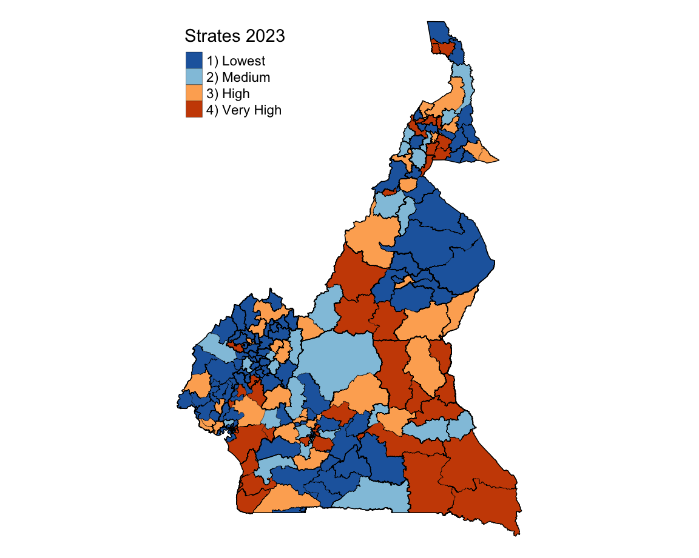

```{r, echo=FALSE, out.width='20%', fig.align='right'}
knitr::include_graphics("logos/map_logo.png")

```

---


### **Cameroon Malaria Epidemiology Summary**


---

#### **Introduction**

Cameroon located in Central Africa, borders Nigeria to the west and north, Chad to the northeast, the Central African Republic to the east, and Equatorial Guinea, Gabon, and the Republic of the Congo to the south. It's population is about 27 million people (_Cameroon National Institute of Statistics projections, 2022_) and the official languages are French and English. The World Malaria Report 2024 lists Cameroon among the 11 African countries accounting for nearly two-thirds of global malaria cases and deaths.

#### **Administrative Boundaries**

Cameroon is divided into 10 semi-autonomous regions, governed by elected Regional Councils and overseen by presidential appointed governors. Regions are further divided into 58 divisions (départements), led by divisional officers (préfets), and subdivided into sub-divisions (arrondissements) managed by assistant divisional officers (sous-préfets). The smallest units, districts, are administered by district heads (chefs de district) and are found in remote or large sub-divisions. The administrative and health systems are distinct but overlap at the regional level. The health system's 200 districts are where malaria decisions are tailored to local needs.

```{r, echo = FALSE, message=FALSE, warning=TRUE}
# Import libraries
library(sf)
library(ggplot2)
library(dplyr)
library(ggthemes)
library(ggspatial)
# Load the shape files of Cameroon map.
HDs <- st_read("CMRN/CMRN_HDs/Cameroon_5_HealthDistricts_2023_May.shp", quiet = TRUE)
cmrn <- st_read("CMRN/CMRN_ADMN1/cmr_admbnda_adm1_inc_20180104.shp", quiet = TRUE)
prot_areas <- st_read("CMRN/ProtectAreas/WDPA_WDOECM_Jan2025_Public_CMR_shp-polygons.shp", quiet = TRUE)
```

```{r, echo=FALSE, message=FALSE, warning=FALSE}
parks <- prot_areas %>%
  filter(DESIG_ENG == "National Park")
ramsar <- prot_areas %>%
  filter(DESIG_TYPE == "International")
# Create a data frame with city names and coordinates
cities <- data.frame(
  name = c("Yaoundé", "Douala"),
  lat = c(3.848, 4.051),    # Latitude of Yaoundé and Douala
  lon = c(11.502, 9.767),# Longitude of Yaoundé and Douala
  type = c("Capital City", "Main City")
)

```

```{r, echo=FALSE, message=FALSE, warning=FALSE, out.width="100%"}
ggplot() +
  # Add background and subregional (HDs) boundaries with transparency
  geom_sf(data = HDs, fill = "#F7F4F2", color = "#C2B9B0", size = 0.3, alpha = 0.5) +
  # Add regional (cmrn) boundaries with prominence
  geom_sf(data = cmrn, fill = NA, color = "#333333", size = 1.2) +
  # Add national parks with a natural green fill
  geom_sf(data = parks, aes(fill = "National Parks"), color = NA, alpha = 0.7) +
  # Add national parks with a natural green fill
  geom_sf(data = ramsar, aes(fill = "Ramsar Sites"), color = NA, alpha = 0.7) +
  # Add region labels
  geom_sf_text(data = cmrn, aes(label = ADM1_EN), color = "darkblue", 
               size = 2.5, fontface = "bold", alpha = 0.85) +
  # Add cities
  geom_point(data = cities, aes(x = lon, y = lat, fill = type),
             size = 2, shape = 21, color = "black") +
  # Add city labels
  geom_text(data = cities, aes(x = lon, y = lat, label = name), 
            color = "black", fontface = "bold", size = 1.5, nudge_y = 0.2) +
  # Enhance theme for poster presentation with a soft background
  theme_map() +
   theme(
    plot.background = element_rect(fill = "#EAF2F8", color = NA),  # Full plot background
    plot.title = element_text(size = 14, face = "bold", hjust = 0.5),
    plot.subtitle = element_text(size = 12, hjust = 0.5, color = "darkgrey"),
    plot.margin = margin(t = 10, r = 48, b = 10, l = 10),
    plot.caption = element_text(hjust = 0, size = 8, face = "italic"),
    legend.position = c(0,0.6),
    legend.key.size = unit(0.4, "cm"),
    legend.text = element_text(color = rgb(0,0,0, alpha = 0.85)),
    legend.title = element_blank(),
    axis.text = element_blank(),
    axis.ticks = element_blank(),
    panel.grid = element_blank(),
    axis.title = element_blank()
  ) +
    # Manual scale for legend, combining water bodies, National parks, and cities
  scale_fill_manual(
    values = c(
      "National Parks" = "#83C99F",
      "Main City" = "#A52A2A",
      "Capital City" = "blue",
      "Ramsar Sites" = "#5D9FC7"
    )) +
  labs(
    title = "Geographical Map of Cameroon",
    subtitle = "Health Districts in Each Region",
    caption = "Data Source: HDX & Protected Planet",
    fill = "Legend") +
  annotation_north_arrow(location = "tr",
                         height = unit(0.8, "cm"),
                         width = unit(0.4, "cm")) +
  annotation_scale(location = "bl")

ggsave(filename = "../ProBackup/cameroon_adm.png")
```

#### **Health System Reporting**

Cameroon’s health system is decentralized to the regions, there are 10 regions each with a Regional delegation of public health. It operates in a pyramidal structure with three levels. The central level oversees policy, regulation, and supervision, managing general and central hospitals. The intermediate level includes regional health delegations and hospitals, providing technical and supervisory support to health districts. The peripheral level focuses on service delivery through a network of 200 health districts and 1,795 health areas, which include facilities like district hospitals, integrated health centers, and health posts. Across all levels, the country has 6,124 health facilities, with 54% of services delivered by the private sector. However, only 5,795 facilities currently offer malaria services. Healthcare service in Cameroon is provided by public, private, faith based and NGOs as well as traditional healers.

Cameroon also has 9,575 Community Health Workers (CHWs) providing preventive and curative care. CHWs report to the leading health facilities within their areas, with data integrated into the Health Management Information System (HMIS). Despite their critical role, Cameroon has not yet met its target of 15,000 CHWs, leaving some areas under-served.

```{r echo=FALSE, out.width="100%"}
knitr::include_graphics("CMRN/HS.png")
```

#### **Types of Malaria Data**

The District Health Information System (DHIS2) was adopted by Cameroon in 2015. Health facilities and CHWs in Cameroon collect data using harmonized registers, consolidating it weekly for disease surveillance and monthly for routine activities via paper forms. Facilities with digital capacity enter data directly into the DHIS2 platform, while others send paper-based reports to health districts for entry. The CHWs report data of all ages as highlighted in the table below. The routine health system collect the following malaria indicator data:

```{r echo=FALSE, out.width="100%", out.height="100%"}
knitr::include_graphics("CMRN/rdata.jpg")
```

Moreover, the country has gathered information on malaria prevention, treatment and prevalence through surveys such as Demographic Health Surveys (DHS), Malaria Indicator Cluster Surveys (MICS), Malaria Indicator Surveys (MIS), and behaviors influence the prevention and treatment practices through Malaria Behavior Survey (MBS). 

```{r echo=FALSE, out.width="100%", out.height="100%"}
knitr::include_graphics("CMRN/sdata.jpg")
```

#### **History of Malaria**

The graphic below illustrates the trend of malaria prevalence in Cameroon since 2004, alongside significant events that have occurred. The prevalence values are based on data from Demographic and Health Surveys (DHS) and Malaria Indicator Surveys (MIS). Additionally, the country has implemented four National Malaria Strategic Plans (NMSPs) at varying intervals.

```{r echo=FALSE, out.width="100%"}
knitr::include_graphics("CMRN/MHist.png")
```

#### **Weather and Seasonality**

Cameroon has a highly diverse ecology and climate that support the development of malaria vectors, with variations across it's regions. The southern part, including the Central, Eastern, Littoral, South, and South-West regions, is characterized by dense forests, a vast hydrographic network, and a hot, humid equatorial climate with abundant rainfall, conducive to malaria transmission. The coastal plain at the Gulf of Guinea is at low altitude, while the highlands in the West and North-West regions, with volcanic soils and altitudes above 1,100 m, feature less dense vegetation and cooler climates. The northern Sahelian Sudan region, encompassing Adamaoua, North, and Far North regions, transitions from temperate climates with shrub Savannah to hot, dry zones near Lake Chad. 

Cameroon has three main climatic zones: the equatorial climate (2°–6°N) with abundant rainfall and either a bi modal pattern (two rainy and two dry seasons) in the south or a long rainy season (9 months) in the South-West and Western Highlands; the Sudanese tropical climate (6°–8°N) with a single rainy season (March–October) and dry season (November–February); and the Sahelian tropical climate (north of 8°N) with a shorter rainy season (3–5 months, June–October) and decreasing rainfall towards Lake Chad.

```{r, echo=FALSE, warning=FALSE, out.width="100%"}
# Categorize the regions into climatic zones.
cmrn_zones <- cmrn %>%
  mutate(climate = case_when(
      ADM1_EN %in% c("North", "Far-North") ~ "Sahelian tropical",
      ADM1_EN == "Adamawa" ~ "Sudanese tropical",
      TRUE ~ "Equatorial"
    ))
```


```{r, echo=FALSE, warning=FALSE}
# Plot the Cameroon regions
ggplot() +
  geom_sf(data = cmrn_zones, aes(fill = climate), color = "grey", alpha = 0.9) +
  geom_sf_text(data = cmrn_zones, aes(label = ADM1_EN), size = 2.5, fontface = "bold", alpha = 0.85) +
  scale_fill_manual(values = c("Equatorial" = "#31a354", 
                               "Sahelian tropical" = "#f7fcb9", 
                               "Sudanese tropical" = "#addd8e")) +
  labs(title = "Climatic Conditions in Cameroon",
       fill = "Climate Type",
       caption = "Data source: Cameroon NMSP 2019-2023") +
  theme_map() +
  theme(legend.position = c(0, 0.65),
        plot.background = element_rect(fill = "azure", color = NA),
        plot.caption = element_text(size = 8, face = "italic", hjust = 0.5),
        plot.title = element_text(size = 14, face = "bold", hjust = 0.5),
        plot.margin = margin(r = 40),
        legend.key.size  = unit(0.4, "cm"),
        legend.text = element_text(color = rgb(0, 0, 0, alpha = 0.85))
         ) +
  annotation_north_arrow(location = "tr",
                         height = unit(0.8, "cm"),
                         width = unit(0.4, "cm")) +
  annotation_scale(location = "bl")
  
ggsave(filename = "../ProBackup/cameroon_peak.png")  
```


#### **Current Stratification**

Malaria stratification map for Cameroon was last updated in 2023. It was developed by combining data on malaria prevalence, malaria incidence, and all-cause mortality rates in children under 5 years of age to classify country's heath districts into; very high, high, medium, and low risk.

```{r echo=FALSE, out.width="100%"}

```

_**Description** : Epidemiological Stratification of Health Districts in Cameroon.
<br> **Source** : U.S.President's Malaria Initiative Cameroon Malaria Profile._

#### **Reference**

1. Cameroon National Malaria Strategic Plan (NMSP 2019-2023)
2. [Severe malaria observatory](https://www.severemalaria.org/)
3. [PMI malaria operation plans](https://www.pmi.gov/)
4. [Malaria HIS portals](https://malariaportal.org/index.php/country-rhis-profiles)
5. [Cameroon malaria case management](https://assets-eu.researchsquare.com/files/rs-4361698/v1/5aa8079f-11e2-46a3-bb41-566f9cbd921b.pdf?c=1715709741)
6. [Cameroon health system](https://www.researchgate.net/figure/Pyramidal-organization-of-health-facility-system-in-Cameroon-Note-Health-facilities-are_fig1_380401132)