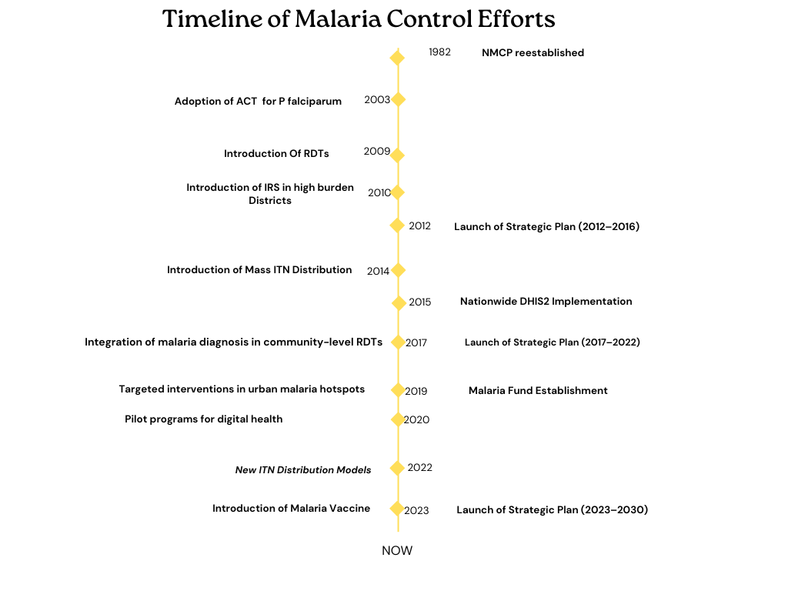
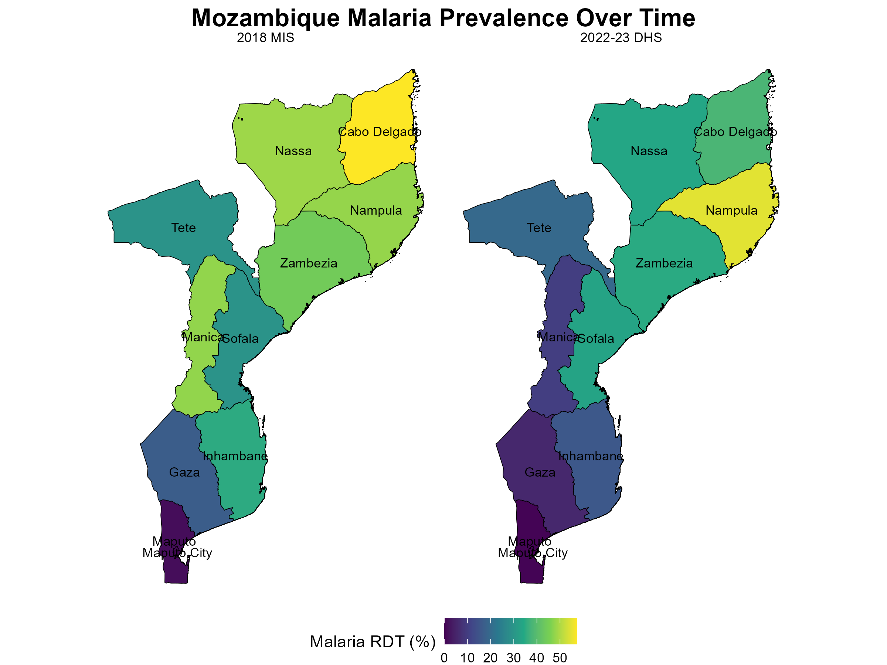
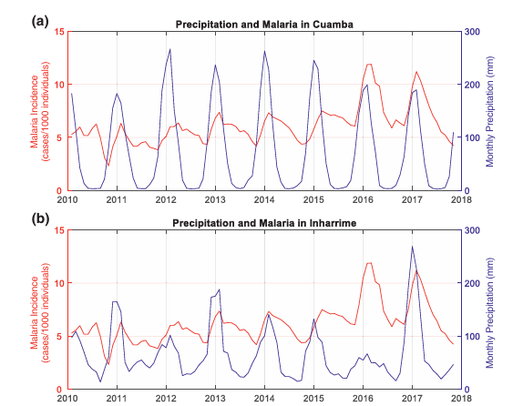
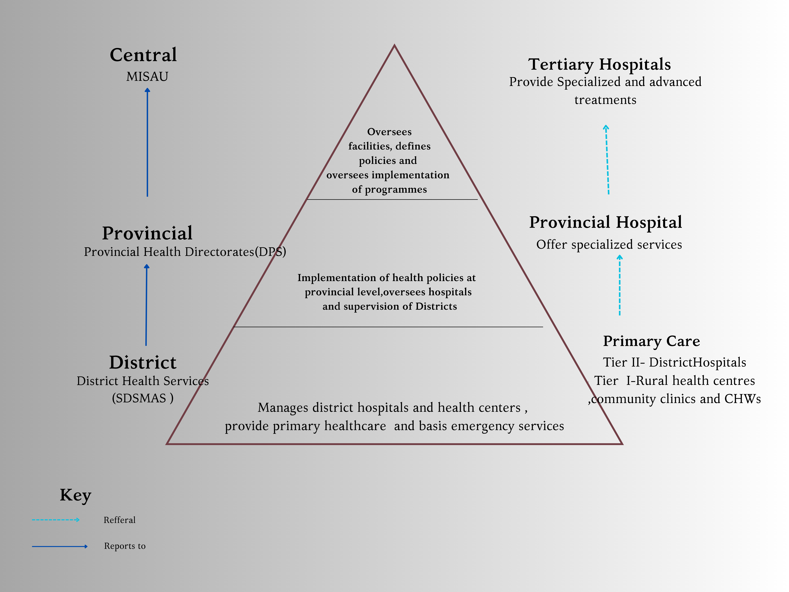
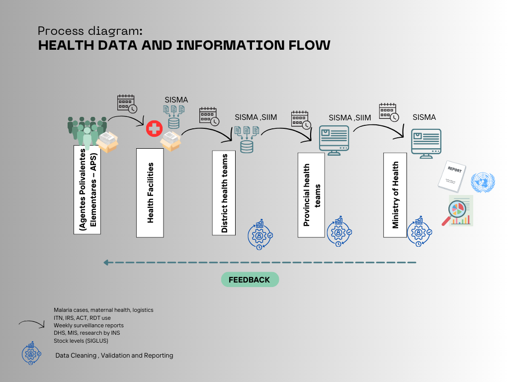
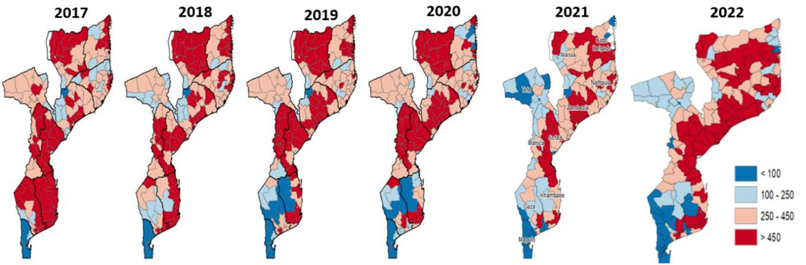
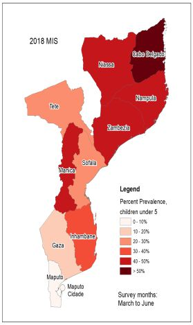
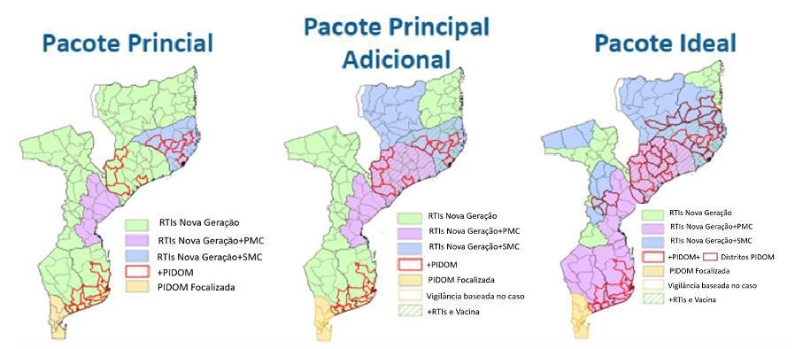

```{r, echo=FALSE, out.width='20%', fig.align='right'}

##add map logo on the top right corner
knitr::include_graphics("logos/map_logo.png")

```

---


###  **MOZAMBIQUE MALARIA EPIDEMIOLOGY SUMMARY**


*Author*:  Herieth Alexander   *Last Updated*: 12/12/2024

---

```{r setup,echo=FALSE, warning=FALSE, message=FALSE}

# Create a function to format all tables
table_formatting <- function(x) {
  x %>%
    kable_styling(bootstrap_options = c("striped", "hover", "condensed"),
                  font_size = 12, 
                  position = "center", 
                  full_width = TRUE) %>%
    column_spec(1, bold = TRUE, color = "black", background = "#DAA520") %>%
    column_spec(2, background = "gray", color = "white")
}

# Load the required libraries

library(raster)
library(kableExtra)
library(leaflet)
library(tidyverse)
library(knitr)
library(ggplot2)
library(dplyr)
library(sf)             # For spatial data manipulation
library(rnaturalearth)  # For country shapefiles
library(rnaturalearthdata)
library(renv)
library(terra)
library(openxlsx)
library(ggspatial)
suppressWarnings(library(curl))
```


#### **MALARIA SITUATION**

Mozambique contributes approximately to 5% of globally observed malaria cases annually. This makes it one of the 11 nations that bear 70 percent of the world’s malaria burden .In Mozambique close to half of pediatric admissions are due to malaria and a third of hospital deaths are attributed to malaria. Mozambique reported about 10.4 million cases  and 21,551 deaths in 2022 .Efforts to reduce transmission have resulted in some improvements but cyclones and extremist groups have been the greatest threats to this progress as the resulting displacement , deaths and break in service provision often leave societies vulnerable. 


```{r, echo = FALSE,out.width='80%', fig.align='center'}
## view key country indicators
# Load the data
data <- openxlsx::read.xlsx("data files/epi tables.xlsx" , sheet = 1)


# Filter rows where Types = "KCI"
kci_data <- data %>% 
  filter(Types == "KCI")

# Filter for MZA KCI data
kci_MZ <- kci_data %>%
  select(Metric, Mozambique) %>%
  filter(!is.na(Mozambique))%>%
  mutate(Mozambique = as.numeric(Mozambique),      # Convert to numeric if not already
         Mozambique = round(Mozambique, 1))
# Display table
table_formatting(kable(kci_MZ, caption = "Key demographic , development and malaria indicators" )) 


```
*Sources- WORLD BANK , MSP 2023-2030 , DHS Program*


 
```{r, echo=FALSE, warning=FALSE, message=FALSE}

# Create the dataset
trenddata <- data.frame(
  Year = c(2011, 2015, 2018, 2022),
  Prevalence = c(38.3,40.2,38.9,32.3),
 'Incidence per 1000'= c( 370,349,321,316),
  Deaths = c( 23588,22210,19387,21559)
)

# Convert data to long format for faceting
data_long <- trenddata %>%
  pivot_longer(cols = c(Prevalence, 'Incidence.per.1000', Deaths), 
               names_to = "Metric", 
               values_to = "Value")

# Create faceted plot
suppressWarnings( ggplot(data_long, aes(x = Year, y = Value)) +
  geom_line(aes(color = Metric), size =0.8) +
  geom_point(aes(color = Metric), size = 1) +
  facet_wrap(~ Metric, scales = "free_y", ncol = 1) +
  theme_minimal() +
  labs(title = "Trend of Malaria burden in Mozambique", x = "Year", y = "Value") +
  theme(legend.position = "none")) # Remove legend since facets are labeled
```


Mozambique has about 2500km of coastline along the Indian Ocean making it vulnerable to tropical cyclones. On avarage , Mozambique experiences 4 to 5 cyclones a year with majority of them not only entering its  sphere of influence but also making landfall. Nampula, Zambézia and Sofala  are the regions that have been mostly affected .The typical cyclone season depends on the summer monsoon. In the months before (May to June) and after (October to November), the most severe storms occur.In December 15th , 2024 a Category 4 cyclone made land fall . The cyclone named Chido was 50 kilometers in Diamter with  speeds of up to 220 km/h were measured on the open sea.


**Malaria Control Interventions**

Mozambique has multiple interventions in place to combat malaria transmision. Insecticide-Treated Nets (ITNs) are distributed through mass campaigns and routine systems. Indoor Residual Spraying (IRS)is targeted in high-risk areas. Malaria vaccines based on global evidence have been piloted for intergration in routine child immunization.To improve outcomes in malaria cases ,Artemisinin-based Combination Therapies (ACTs) are used as first-line treatment and there is efforts towards Universal testing for suspected cases and Strengthened referral systems for severe malaria.

In addition to current efforts , Mozambique realizes the interplay of various factors into malaria transmission and  collaboration with agriculture, education, and urban planning to mitigate malaria drivers (e.g., irrigation projects, housing improvements ) is part of malaria mitigation strategies. 

Over the past 20 years , Mozambique has made significant progress in malaria control including adoption of policy to direct local implementation control activities.

```{r, echo=FALSE, out.width='85%'}
###Malaria History (Last 20 Years)



```

**Mozambique Malaria Strategic Plan (MSP) 2023-2030 summary**

Mozambique has set ambitious malaria reduction goals for 2030, aiming to decrease national malaria incidence from 392 cases per 1,000 in 2022 to 216 cases per 1,000, lower hospital mortality from 1 per 100,000 to 0.77 per 100,000, and eliminate local transmission in 20 low-transmission districts. To achieve these targets, the country has outlined six strategic objectives.

First, it seeks to strengthen health systems and enhance multisectoral coordination to ensure an integrated response. Second, Mozambique aims to ensure universal access to effective vector control measures and malaria vaccination. Third, all suspected malaria cases will be tested and treated to improve case management and reduce transmission. Fourth, communication efforts will be enhanced to drive behavioral change and community engagement. Fifth, Mozambique will strengthen surveillance and response systems to improve data collection and rapid intervention. Lastly, efforts will be made to maintain malaria services during emergencies, ensuring uninterrupted prevention and treatment even in crisis situations.


````{r, warning=FALSE ,message=FALSE, echo=FALSE}

# Load data from the Excel file
df <- openxlsx::read.xlsx("data files/STATcompilerExport202524_9266.xlsx")

# Replace full stops with spaces in column names
colnames(df) <- gsub("\\.", " ", colnames(df))

# Remove numbers inside parentheses from both columns
df <- df %>%
  mutate(
    `Malaria prevalence according to RDT` = gsub("\\s*\\(.*?\\)", "", `Malaria prevalence according to RDT`),
   `Malaria prevalence according to microscopy` = gsub("\\s*\\(.*?\\)", "", `Malaria prevalence according to microscopy`)
  )

# Convert columns to numeric
df <- df %>%
  mutate(across(
    c(
      `Malaria prevalence according to RDT`, `Malaria prevalence according to microscopy`,
      `Households with at least one insecticide-treated mosquito net (ITN)`, 
      `Net source: Mass distribution campaign`, 
      `Persons with access to an insecticide-treated mosquito net (ITN)`,
      `Population who slept under an insecticide-treated mosquito net (ITN) last night`,
      `Existing insecticide-treated mosquito nets (ITNs) used last night`,
      `Households with indoor residual spraying (IRS) in last 12 months`, 
      `SP/Fansidar 2+ doses during pregnancy`, 
      `SP/Fansidar 3+ doses during pregnancy`, 
      `Children under 5 with fever in the last two weeks`,
      `Children with fever for whom advice or treatment was sought, the source was a public sector facility`,
      `Children with fever for whom advice or treatment was sought, the source was a private sector facility`,
      `Children who took any ACT`
    ),
    as.numeric, 
    .names = "{.col}"
  ))


# Filter data for a specific country 
df_country <- df %>%
  filter(Country == "Mozambique") %>%
  select (-Country) #removes country collumn
  

# Pivot data from wide to long format
df_long <- df_country %>%
  pivot_longer(
    cols = c(
      `Malaria prevalence according to RDT`, `Malaria prevalence according to microscopy`,
      `Households with at least one insecticide-treated mosquito net (ITN)`, 
      `Net source: Mass distribution campaign`, 
      `Persons with access to an insecticide-treated mosquito net (ITN)`,
      `Population who slept under an insecticide-treated mosquito net (ITN) last night`,
      `Existing insecticide-treated mosquito nets (ITNs) used last night`,
      `Households with indoor residual spraying (IRS) in last 12 months`, 
      `SP/Fansidar 2+ doses during pregnancy`, 
      `SP/Fansidar 3+ doses during pregnancy`, 
      `Children under 5 with fever in the last two weeks`,
      `Children with fever for whom advice or treatment was sought, the source was a public sector facility`,
      `Children with fever for whom advice or treatment was sought, the source was a private sector facility`,
      `Children who took any ACT`
    ),
    names_to = "Indicator",
    values_to = "Value"
  )

# Pivot wider again to make survey years as columns
df_wide <- df_long %>%
  pivot_wider(
    names_from = Survey,
    values_from = Value
  )
# Display table 
df_wide %>%
  kbl(caption = "Evolution of Key Malaria Indicators over the time") %>%
  kable_styling(full_width = TRUE, bootstrap_options = c("striped", "hover")) %>%
  row_spec(0, bold = TRUE) %>%  # Make column names bold
  column_spec(1:ncol(df_wide), background = "#DAA520")  # Apply yellow background to all columns

````
_source-**DHS program**_


```{r, echo=FALSE, out.width="80%", fig.align='center'}



```


#### **ADMINISTRATIVE BOUNDARIES**


Mozambique is administratively divided into 11 provinces ( _provincias_ ), 161 districts( _distritos_ ), 444 administrative posts ( _postos administrativos_ )and then into localities ( _localidades_ ). There are 65 municipalities (recently increased).Administrative and health districts are one and the same and there is on going efforts to decentralize and improve autonomy of Provinces.

Approximately 66% of Mozambican population resides in rural areas. Urbanization is more pronounced in Maputo City, while Zambézia and Nampula have a predominantly rural population. The country's average population density is 32 people per km², with coastal and northern regions being more densely populated. 
```{r , echo=FALSE, warning=FALSE, message=FALSE, include=FALSE}

# Load all rivers
suppressMessages(rivers <- ne_download(scale = "medium", type = "rivers_lake_centerlines", category = "physical", returnclass = "sf"))

# Load all lakes
suppressMessages (lakes <- ne_download(scale = "medium", type = "lakes", category = "physical", returnclass = "sf"))

# Download world ocean shapefile
suppressMessages (ocean <- ne_download(scale = 10, type = "ocean", category = "physical", returnclass = "sf"))


```


```{r, warning=FALSE,message=FALSE, out.width= '120%',echo=FALSE}
# Load Africa Country Boundaries
africa <- ne_countries(continent = "Africa", returnclass = "sf")

# Load coastline data
coastlines <- ne_coastline(scale = 10, returnclass = "sf")


# Extract Admin 1 boundaries 
mozambique_regions <- ne_states(country = "Mozambique", returnclass = "sf")


# Subset Mozambique and Its Neighbors
mozambique <- africa[africa$sovereignt == "Mozambique", ]
neighbors <- africa[africa$sovereignt %in% c("United Republic of Tanzania", "Malawi", "Zambia", 
                                             "Zimbabwe", "South Africa", "Eswatini"), ]

# Transform to a projected CRS
moz_proj_crs <- st_crs("EPSG:4326")
mozambique <- st_transform(mozambique, crs = moz_proj_crs)
neighbors <- st_transform(neighbors, crs = moz_proj_crs)
coastlines <- st_transform(coastlines, crs = moz_proj_crs)
rivers <- st_transform(rivers, crs = moz_proj_crs)
lakes <- st_transform(lakes, crs = moz_proj_crs)

# Compute centroids for labeling
neighbors <- neighbors %>%
  mutate(centroid = st_centroid(geometry)) %>%
  mutate(x = st_coordinates(centroid)[,1], y = st_coordinates(centroid)[,2])

# Major cities
cities <- data.frame(
  Name = c("Maputo", "Beira", "Nampula", "Pemba"),
  Latitude = c(-25.9692, -19.8333, -15.1167, -12.974),
  Longitude = c(32.5732, 34.8500, 39.2833, 40.5178)
)
cities_sf <- st_as_sf(cities, coords = c("Longitude", "Latitude"), crs = 4326)
cities_sf <- st_transform(cities_sf, crs = moz_proj_crs)

# Mount Binga (Mozambique's highest peak)
mount_binga <- st_as_sf(
  data.frame(name = "Mount Binga", lon = 32.71, lat = -19.72),
  coords = c("lon", "lat"), crs = 4326
)
mount_binga <- st_transform(mount_binga, crs = moz_proj_crs)

# Plot Map
ggplot() +
  geom_sf(data = ocean, fill = "#ADD8E7", color = NA)  +
  # Neighboring countries shaded beige
  geom_sf(data = neighbors, fill = "beige", color = "black", alpha = 0.4) +  
 geom_text(data = neighbors, aes(x = x, y = y, label = sovereignt), 
            color = "black", fontface = "italic", size = 2) +
  # Mozambique regions with names directly on the map
  geom_sf(data = mozambique_regions, aes(fill = name), color = "black", alpha = 0.6) +  
  geom_sf_text(data = mozambique_regions, aes(label = name), color = "black", size = 2) +  

  # Coastline
  geom_sf(data = coastlines, color = "#ADD8E7", linewidth = 0.6) +  

  # Rivers (light blue)
  geom_sf(data = rivers, color = "lightblue", linewidth = 0.8, alpha = 0.7) +  

  # Lakes (Green with Dark Blue outline)
  geom_sf(data = lakes, fill = "lightblue", color = "darkblue", alpha = 0.5) +  

  # Major Cities (Using Triangles)
  geom_sf(data = cities_sf, color = "black", fill = "blue3", size = 1, shape = 24, stroke = 1) +  
    # Customize legend
  scale_color_manual(name = "Legend", values = c("Major Cities" = "black")) +

  # Mount Binga (Brown Star)
  geom_sf(data = mount_binga, color = "brown", size = 3, shape = 8) +  
  geom_text(data = mount_binga, aes(x = st_coordinates(geometry)[,1], 
                                    y = st_coordinates(geometry)[,2], 
                                    label = name), 
            color = "brown4", size = 2) +  


  

  # Remove all legends
  theme_void() +
  theme(legend.position = "none") +

  # Title and Caption
  labs(title = "Mozambique Regions",
       caption = "Source: Natural Earth") +

  # Adjust the coordinates
  coord_sf(xlim = c(29.18, 42.78), ylim = c(-27.74, -9.32), expand = FALSE)


```


#### **MALARIA TRANSMISSION PATTERNS** 

**Role of Climate and Urbanization**

As in most countries, malaria burden is unevenly distributed across Mozambique.  Urbanization plays a significant role, as people living in rural areas are three times more likely to test positive for malaria and report more malaria-related deaths . Since most of the population lives in rural areas, where health infrastructure is often inadequate, this disparity poses a significant challenge.  

Mozambique   has a transitional climate ranging from  tropical in the north to subtropical climate in the south. This is also reflected in transmission rates.Transmission decreases as you move from northern and coastal areas to south and high attitude areas.Prevalence in the Northern and Central regions ranges from 29% in Sofala to 57% in Cabo Delgado. Southern Mozambique generally has low transmission, except for Inhambane, where prevalence rates have reached as high as 35%.  
Rainy seasons are slightly longer in the north and occur in the months of November-to April. There is a lag between onset of rains and the annual peak of the malaria outbreak . This varies with each district and year but typically ranges from 6 to 10 weeks and therefore the peak in malaria prevalence typically occurs around January-March. Negative El Niño(La Nina) years increase malaria transmission in the southern region. 


```{r, echo=FALSE, message=FALSE,out.width='70%', fig.align='center',fig.cap="Variation of Malaria Cases and rainfall patterns"}
##SCHEMATIC OF HEALTH REPORTING



```
Adapted from:[ Interannual climate variability and malaria in Mozambique. GeoHealth,Harp et al](https://agupubs.onlinelibrary.wiley.com/doi/pdfdirect/10.1029/2020GH000322)

**Vector and parasite species**

Malaria in Mozambique is primarily caused by Plasmodium falciparum, the most virulent malaria parasite. The disease is transmitted by various Anopheles mosquito species, with Anopheles gambiae being dominant in the northern and central regions, while An. funestus is widespread along the coast. In the south and central areas, An. arabiensis is a key vector. An emerging concern is An. stephensi, which poses a growing threat, particularly in urban environments.


```{r,echo=FALSE,out.width='80%', fig.align='center'}
###vectors
# Filter rows where Types = "Vectors"
vector_data <- data %>% 
  filter(Types == "Vectors")


# Filter for BFA KCI data
vector_MZ <- vector_data %>%
  select(Metric, `Mozambique`) %>%
  filter(!is.na(`Mozambique`))

# Display table
table_formatting (kable(vector_MZ, caption = "Key agents in Malaria Transmision" ))

```


#### **ORGANISATION OF HEALTH ADMINISTRATION , SERVICE DELIVERY AND REPORTING**

Public health services cater to approximately 60% of the population, with private facilities serving about 10%.There has been progressive investment in health infrastructure, particularly rural healthcare.The health sector is coordinated nationally by the Ministry of Health (MISAU), with implementation devolved to Provincial Health Directorates (DPS) and District Health Services (SDSMAS). There is efforts to decentralize resources and decision-making authority from central to provincial level.


The healthcare system is hierarchically structured into four levels:

- Level I & II: Primary care, peripheral facilities (health posts and rural clinics)

- Level III & IV: Secondary and tertiary care with specialized services.

**Community Health Workers (CHWs):**

CHWs, locally known as Agentes Polivalentes Elementares (APEs)  play a critical role in healthcare delivery, especially in remote areas.There are 17,648 deployed out of 18,000 planned and 5595 of these are involved in diagnosing and treating uncomplicated malaria as well as  promoting preventive measures, and referring severe cases. APEs are keystone for malaria control in rural and remote areas.


```{r , echo=FALSE , out.width='80%', fig.align='center',fig.cap="Organisation of Health Administration and Service delivery"}


```

Mozambique transitioned from paper based reporting that was aggregated at district ,provincial and national level to a DHIS2 based system in 2015. While the initial approach  was reliable and consistent , the quality of data did not meet malaria control management needs. Currently a full information M&E system based on the DHIS2 platform  collects malaria data. This includes outpatient attendance, testing, and confirmed cases, with dis aggregation by age and gender. Facilities with electronic systems fill data directly to the system and paper based records are entered into the system by District health teams .Efforts are underway to strengthen real-time data availability for decision-making.


```{r, echo=FALSE, message=FALSE,out.width='85%', fig.align='center'}
##sCHEMATIC OF HEALTH REPORTING



```

Surveys like IMASIDA (Immunization, Malaria, HIV Indicators Survey) provide periodic data on treatment-seeking behavior, bed-net use, and coverage of interventions.
Indicators tracked include Outpatient visits for suspected malaria , Laboratory-confirmed cases by rapid diagnostic tests (RDTs) with Age-disaggregated data on positive cases as well as bed-net coverage and use.

```{r, echo = FALSE, fig.align='center'}
###Types of Malaria Data
# Filter rows where Types = "Types of Malaria Data"
malaria_data <- data %>% 
  filter(Types == "Types of Malaria Data")


# Filter for BFA KCI data
Malariadata_MZ <- malaria_data %>%
  select(Metric, `Mozambique`) %>%
  filter(!is.na(`Mozambique`))


# Remove the last four rows
Malariadata_MZ <- Malariadata_MZ[1:(nrow(Malariadata_MZ)-4), ]

# Add the Breakdown column
Malariadata_MZ$Breakdown <- c(
  "Age and Sex",
  "Age and Sex",
  "NA",
 "NA",
 "NA",
  "Age, Sex and test type",
   "Age and Sex",
  "NA",
  "Age and Sex",
  "NA",
  "Age and Sex"
)
# Display table
table_formatting(kable(Malariadata_MZ, caption = "SCHEMA OF REPORTING AND DIS-AGREGATION OF HEALTH INFORMATION" ))
```

#### **CURRENT STRATIFICATION MAPS** 

Mozambique incorporated maps to inform decison making and planning .  A structured approach to optimizing malaria interventions in Mozambique involves using complementary analytical methods. It begins with spatial analysis of malaria burden to prioritize high-impact areas. Empirical data analysis and mathematical models help refine intervention targeting by evaluating past interventions and predicting optimal strategies. Cost-effectiveness analysis ensures interventions maximize case reductions within a fixed budget over five years. Finally, operational feasibility adjustments account for logistical and geographic constraints, ensuring interventions are practical and effectively implemented. This multi-faceted approach enhances the impact and efficiency of malaria control efforts.In addition to prevalence and incidence maps , risk maps and vulnerability to epidemics are mapped at district level. This aids with tailoring of interventions.


```{r, echo = FALSE,out.width='80%', fig.align='center',fig.cap="Malaria incidence trend at district level"}
 
 
```
 


```{r, echo = FALSE,out.width='40%', fig.align='center',fig.cap="Malaria prevalence in Under-fives by Province"}
 
``` 
 
``

```{r, echo = FALSE,out.width='80%', fig.align='center',fig.cap="Tailored Intervention Packages based on burden"}
 

```

#### **REFERENCES**


1. [PMI MOP](https://www.pmi.gov/wp-content/uploads/2024/04/FY-2024-Mozambique-MOP-1.pdf) 
2. [National Strategic Plan 2023](https://drive.google.com/file/d/1pwltiFoG4WESYsBspG4SR4nTJyyrmaE_/view) 
3. [DHS Country Data](https://www.dhsprogram.com/Countries/Country-Main.cfm?ctry_id=61/) 
4. [RHIS](https://drive.google.com/file/d/1_qfr-xuowp4cPTpSH28I695BYzwLDtKe/view/) 
5. [Epidemiology and control profile of malaria in 
Mozambique](https://web-archive.lshtm.ac.uk/www.linkmalaria.org/sites/link/files/content/country/profiles/Mozambique-profile-web.pdf) 
6. [Interannual Climate Variability and Malaria in Mozambique](https://agupubs.onlinelibrary.wiley.com/doi/pdfdirect/10.1029/2020GH000322) 
7. [End Malaria Global Community Health Dashboard](https://dashboards.endmalaria.org/en/global-community-health)
