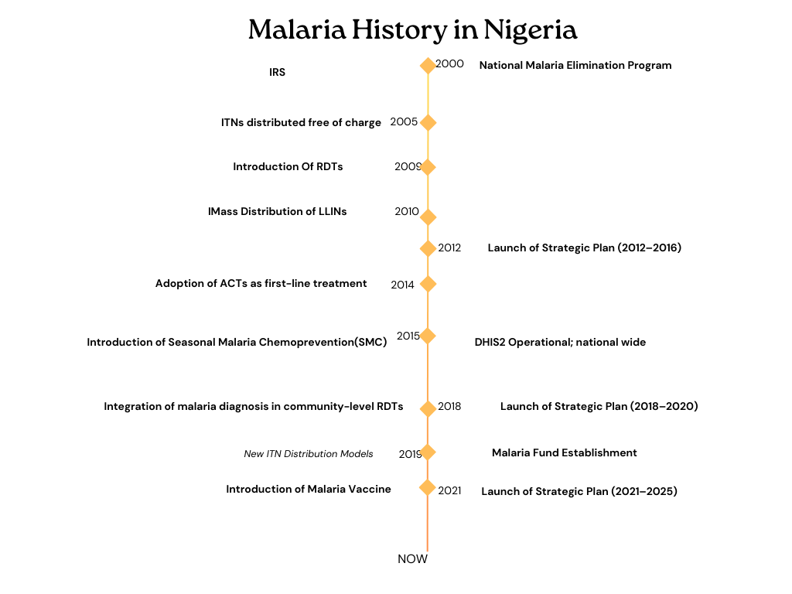
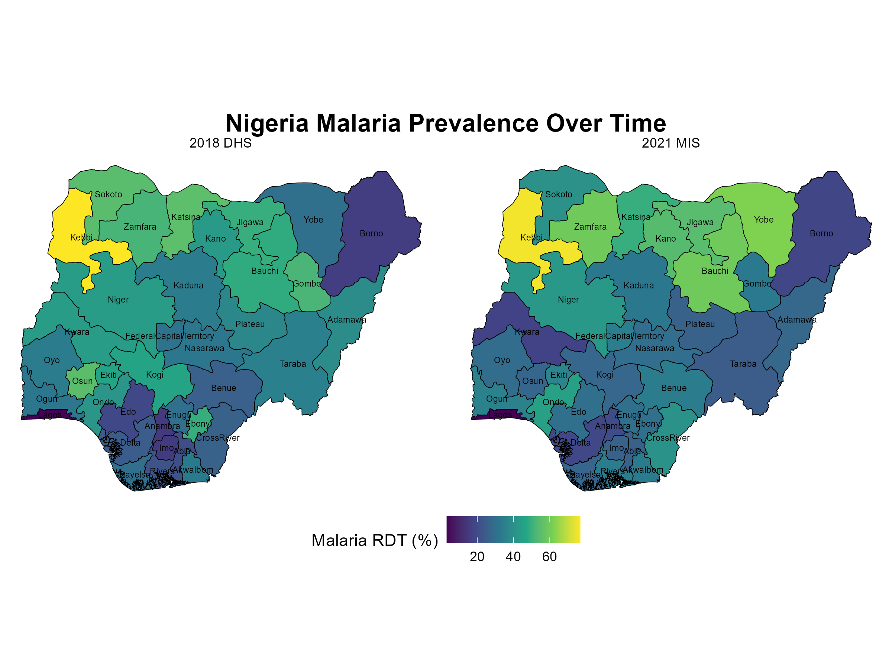
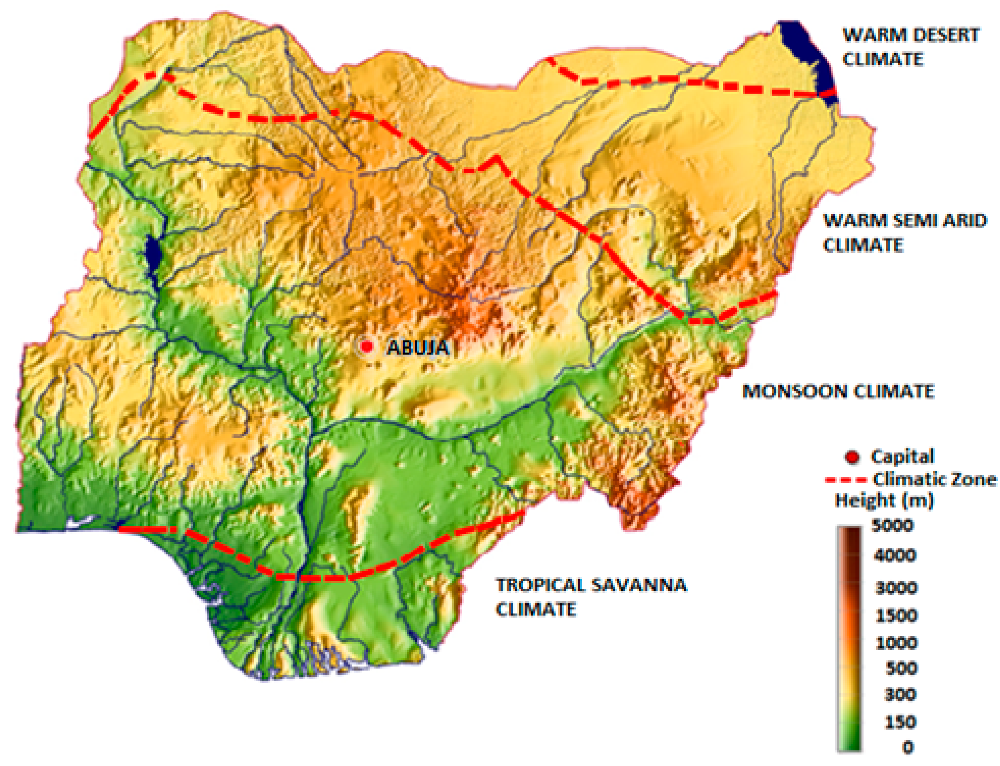
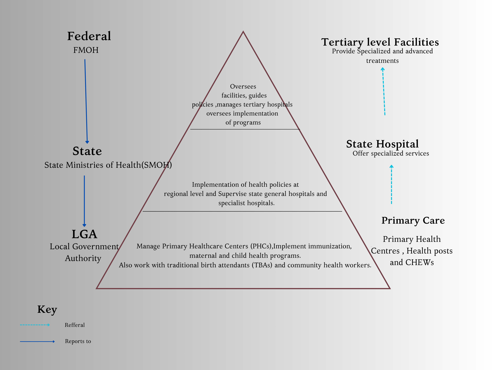
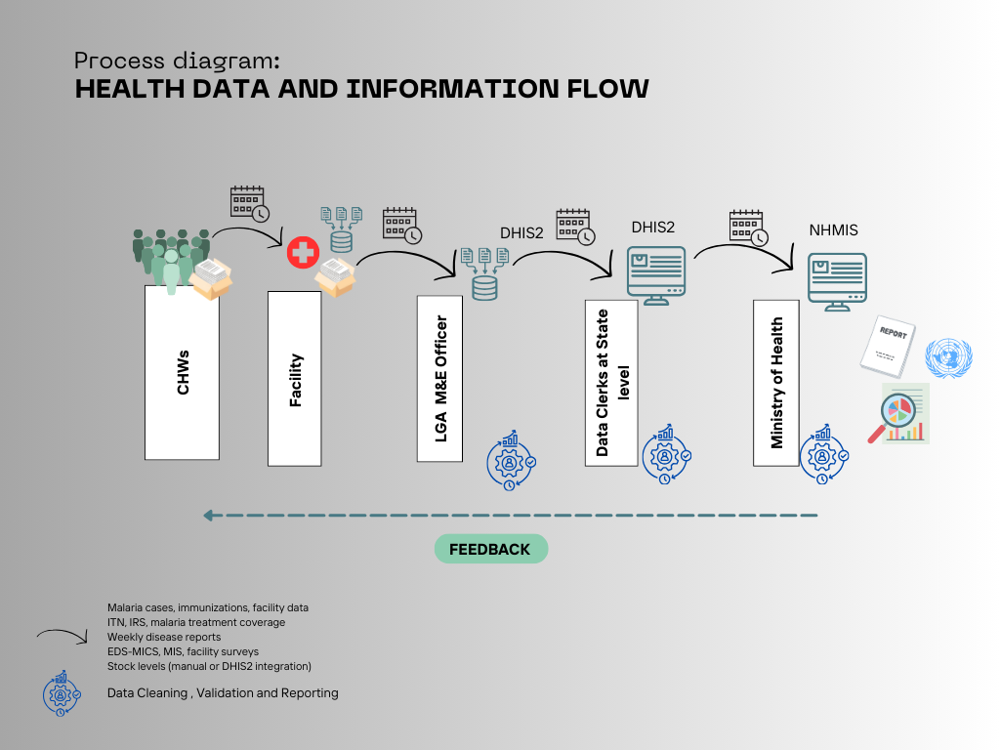
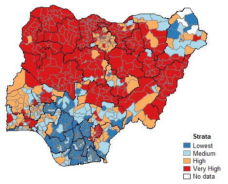
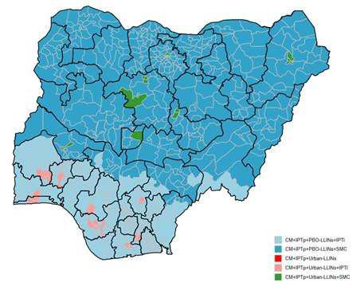

```{r, echo=FALSE, out.width='20%', fig.align='right'}
knitr::include_graphics("logos/map_logo.png")

```

```{r setup,echo=FALSE, warning=FALSE, message=FALSE}

# Create a function to format all tables
table_formatting <- function(x) {
  x %>%
    kable_styling(bootstrap_options = c("striped", "hover", "condensed"),
                  font_size = 12, 
                  position = "center", 
                  full_width = TRUE) %>%
    column_spec(1, bold = TRUE, color = "black", background = "#DAA520") %>%
    column_spec(2, background = "grey", color = "white")
}

# Load the required libraries

library(raster)
library(kableExtra)
library(leaflet)
library(tidyverse)
library(knitr)
library(ggplot2)
library(dplyr)
library(sf)             # For spatial data manipulation
library(rnaturalearth)  # For country shapefiles
library(rnaturalearthdata)
library(rnaturalearthhires)
library(renv)
library(terra)
library(openxlsx)
library(ggspatial)
```

---


###  **NIGERIA MALARIA EPIDEMIOLOGY SUMMARY**

*Author*:  Herieth Alexander
*Last Updated*: 12/12/2024

---


#### **MALARIA SITUATION**

Nigeria bears slightly more than a quarter of the global malaria burden in cases and deaths.While this can be expected , being the most populated African nation , prevalence rates and incidence rates are also high.   According to the 2018 Malaria Indicator Survey (MIS), the national malaria prevalence was 23%, a significant drop from 42% in 2010. Despite ongoing efforts to scale up intervention coverage , the country remains the African nation with the highest reported malaria cases and deaths, with over 200 million people at risk. The target is to reduce this prevalence to below 10% by 2025, aligning with pre-elimination levels.


```{r, echo = FALSE,out.width='80%'}
## Key country demographic, development, and malaria indicators
# Load the data (replace with the path to your data file)
data <- openxlsx::read.xlsx("data files/epi tables.xlsx" , sheet = 1)

# Filter rows where Types = "KCI"
kci_data <- data %>% 
  filter(Types == "KCI")

# Filter for Nigeria KCI data
kci_NG <- kci_data %>%
  select(Metric, Nigeria) %>%
  filter(!is.na(Nigeria)) %>%
  mutate(Nigeria = as.numeric(Nigeria),      # Convert to numeric if not already
         Nigeria = round(Nigeria, 1))       # Round to 1 decimal place

# Display table
table_formatting(kable(kci_NG , caption= "Key demographic , development and malaria indicators"))

```
*Sources- WORLD BANK , NSP 2021-2025 , DHS Program*


Over the past two decades, Nigeria and its partners have invested substantial human, financial, and material resources to reduce the malaria burden and move towards a malaria-free status. Successive National Malaria Control Plans (2001-2005, 2006-2010, 2009-2013, and 2014-2020) have set ambitious targets. A key goal is to ensure universal access to artemisinin-based combination therapies (ACTs) and achieve at least 80% coverage of all malaria interventions across all populations. Following the adoption of the World Health Organization's High Burden to High Impact (HBHI) approach, Nigeria has committed to leveraging both innovative and existing tools while mobilizing additional resources to combat malaria effectively.


```{r,, echo=FALSE, warning=FALSE, message=FALSE}
# Create the dataset
trenddata <- data.frame(
  Year = c(2010,2015,2018,2021),
  Prevalence = c(51.5, 45.1, 36.2,39.6),
  'Incidence.per.1000' = c(376,294,300,316),
  Deaths = c(199791,169299,180605,191241)
)

# Convert data to long format for faceted plotting
data_long <- trenddata %>%
  pivot_longer(cols = c(Prevalence, 'Incidence.per.1000', Deaths),
               names_to = "Metric", values_to = "Value")

# Plot the faceted line graph
ggplot(data_long, aes(x = Year, y = Value)) +
  geom_line(aes(color = Metric),size = 0.8) +
  geom_point(aes(color = Metric),size = 1) +
  facet_wrap(~Metric, scales = "free_y", ncol = 1) +  # Facet by metric with independent y-axes
  theme_minimal() +
  labs(title = "Trend of Malaria burden in Nigeria",
       x = "Year",
       y = "Value") +
  theme(legend.position = "none")  # Remove legend as facets already distinguish variables

```

Poor governance ,Climate-favorability ,poverty and  the escalating insecurity across Nigeria has posed significant challenges to malaria control efforts. The North East region—particularly Adamawa, Borno, and Yobe states—remains the epicenter of insurgency, leading to widespread displacement of individuals and communities. Internally displaced persons (IDPs) are now scattered across all six North East states, including Bauchi, Gombe, and Taraba. Furthermore, banditry and other forms of insecurity have become prevalent in the North West and North Central regions, exacerbating the challenges faced by health workers, including increased cases of abduction and disruption of healthcare services.

```{r, echo=FALSE, message=FALSE, warning=FALSE}

# Load data (replace 'data.csv' with actual file path)

# Load data from the Excel file
df <- openxlsx::read.xlsx("data files/STATcompilerExport202524_9266.xlsx")


# Replace full stops with spaces in column names
colnames(df) <- gsub("\\.", " ", colnames(df))

# Remove numbers inside parentheses from both columns
df <- df %>%
  mutate(
    `Malaria prevalence according to RDT` = gsub("\\s*\\(.*?\\)", "", `Malaria prevalence according to RDT`),
   `Malaria prevalence according to microscopy` = gsub("\\s*\\(.*?\\)", "", `Malaria prevalence according to microscopy`)
  )


df <- df %>%
  mutate(across(
    c(
      `Malaria prevalence according to RDT`, `Malaria prevalence according to microscopy`,
      `Households with at least one insecticide-treated mosquito net (ITN)`, 
      `Net source: Mass distribution campaign`, 
      `Persons with access to an insecticide-treated mosquito net (ITN)`,
      `Population who slept under an insecticide-treated mosquito net (ITN) last night`,
      `Existing insecticide-treated mosquito nets (ITNs) used last night`,
      `Households with indoor residual spraying (IRS) in last 12 months`, 
      `SP/Fansidar 2+ doses during pregnancy`, 
      `SP/Fansidar 3+ doses during pregnancy`, 
      `Children under 5 with fever in the last two weeks`,
      `Children with fever for whom advice or treatment was sought, the source was a public sector facility`,
      `Children with fever for whom advice or treatment was sought, the source was a private sector facility`,
      `Children who took any ACT`
    ),
    as.numeric, # Convert columns to numeric
    .names = "{.col}"
  ))


# Filter data for a specific country (replace 'CountryName' with the desired country)
df_country <- df %>%
  filter(Country == "Nigeria") %>%
  select (-Country)
  

# Pivot table: Indicators as rows, years as columns, in the specified order
# Pivot data from wide to long format
df_long <- df_country %>%
  pivot_longer(
    cols = c(
      `Malaria prevalence according to RDT`, `Malaria prevalence according to microscopy`,
      `Households with at least one insecticide-treated mosquito net (ITN)`, 
      `Net source: Mass distribution campaign`, 
      `Persons with access to an insecticide-treated mosquito net (ITN)`,
      `Population who slept under an insecticide-treated mosquito net (ITN) last night`,
      `Existing insecticide-treated mosquito nets (ITNs) used last night`,
      `Households with indoor residual spraying (IRS) in last 12 months`, 
      `SP/Fansidar 2+ doses during pregnancy`, 
      `SP/Fansidar 3+ doses during pregnancy`, 
      `Children under 5 with fever in the last two weeks`,
      `Children with fever for whom advice or treatment was sought, the source was a public sector facility`,
      `Children with fever for whom advice or treatment was sought, the source was a private sector facility`,
      `Children who took any ACT`
    ),
    names_to = "Indicator",
    values_to = "Value"
  )

# Pivot wider again to make survey years as columns
df_wide <- df_long %>%
  pivot_wider(
    names_from = Survey,
    values_from = Value
  )
# Display table in RMarkdown with the desired column order and a caption
df_wide %>%
  kbl(caption = "Evolution of Key Malaria Indicators over time") %>%
  kable_styling(full_width = TRUE, bootstrap_options = c("striped", "hover")) %>%
  row_spec(0, bold = TRUE) %>%  # Make column names bold
  column_spec(1:ncol(df_wide), background = "#DAA520")  # Apply green background to all columns


```
_source-**DHS program**_


#### **ADMINISTRATIVE BOUNDARIES**


For political and administrative purposes, Nigeria is divided into six geopolitical zone. These zones group states with shared cultures, ethnicities, and histories, enabling better coordination of governance and development efforts.


```{r, echo = FALSE, warning=FALSE , message=FALSE, out.width='80%'}
###Administrative Boundaries
# Download shapefile for Burkina Faso
nigeria <- ne_countries(scale = "medium", country = "Nigeria", returnclass = "sf")
# Download Burkina Faso's regions shapefile
nigeria_regions <- ne_states(country = "Nigeria", returnclass = "sf")

cities <- data.frame(
  Name = c("Lagos", "Abuja", "Kano", "Port Harcourt", "Ibadan", "Kaduna", "Benin City", "Jos", "Enugu", "Maiduguri"),
  Latitude = c(6.5244, 9.0579, 12.0022, 4.8156, 7.3775, 10.5105, 6.3392, 9.8965, 6.5244, 11.8456),
  Longitude = c(3.3792, 7.4951, 8.5919, 7.0056, 3.9470, 7.4408, 5.6037, 8.8583, 7.5086, 13.1510)
)


# Create a data frame of geopolitical zones
nigeria_zones <- data.frame(
  state = c("Benue", "Kogi", "Kwara", "Nassarawa", "Niger", "Plateau", "Federal Capital Territory",
            "Adamawa", "Bauchi", "Borno", "Gombe", "Taraba", "Yobe",
            "Jigawa", "Kaduna", "Kano", "Katsina", "Kebbi", "Sokoto", "Zamfara",
            "Abia", "Anambra", "Ebonyi", "Enugu", "Imo",
            "Akwa Ibom", "Bayelsa", "Cross River", "Delta", "Edo", "Rivers",
            "Ekiti", "Lagos", "Ogun", "Ondo", "Osun", "Oyo"),
  zone = c(rep("North Central", 7),
           rep("North East", 6),
           rep("North West", 7),
           rep("South East", 5),
           rep("South South", 6),
           rep("South West", 6))
)


# Merge map data with geopolitical zones
nigeria_map <- nigeria_regions %>%
  left_join(nigeria_zones, by = c("name" = "state"))


# Define colors for zones
zone_colors <- c(
  "North Central" = "lightblue",
  "North East" = "lightgreen",
  "North West" = "orange",
  "South East" = "purple",
  "South South" = "red",
  "South West" = "yellow"
)

# Plot map
ggplot(nigeria_map) +
  geom_sf(aes(fill = zone), color = "black") +
  scale_fill_manual(values = zone_colors, na.value = "gray") +
  theme_void() +
  ggtitle("Nigeria's Geopolitical Zones") +
  
  # Place legend inside the map
  theme(
    legend.position = "bottom",  # Adjust (x, y) to position legend inside
   # legend.background = element_rect(fill = "white", color = "black", linewidth = 0.5),  # Box around legend
    legend.key = element_blank(),  # Remove legend key background
    legend.title = element_blank()  # Remove legend title
  ) +

  # Add labels for states (or regions)
  geom_sf_text(aes(label = name), color = "black", size = 3) +

  # Add legend for major cities only
  scale_color_manual(values = c(
    "Lagos" = "red", 
    "Abuja" = "blue", 
    "Kano" = "green", 
    "Port Harcourt" = "purple", 
    "Ibadan" = "orange", 
    "Kaduna" = "pink", 
    "Benin City" = "brown", 
    "Jos" = "yellow", 
    "Enugu" = "cyan", 
    "Maiduguri" = "magenta"
  )) +
  
  guides(color = guide_legend(title = "Major Cities"))

```


 **Malaria Control and Strategic Objectives in Nigeria**  

The Government of Nigeria supports a comprehensive array of malaria control interventions, delivered through routine health services and community-based approaches. These include: 

- Insecticide-Treated Nets (ITNs): Distributed through continuous channels targeting pregnant women at Antenatal Care (ANC) clinics and children at Expanded Program on Immunization (EPI) clinics.  
- Indoor Residual Spraying (IRS): Targeted to high-burden areas.  
- Larval Source Management (LSM): Focused on reducing mosquito breeding sites.  
- Intermittent Preventive Treatment for Pregnant Women (IPTp): Ensures protection during pregnancy.  
- Seasonal Malaria Chemoprevention (SMC): Administered to children in areas with high transmission during the rainy season.  
- Case Management: Diagnosis and treatment of uncomplicated malaria through routine health services and Integrated Community Case Management (iCCM).  
- Treatment of Severe Malaria: Injectable artesunate is used for effective management. 
Nigeria recently received 1 million malaria vaccine doses. The phased implementation plan prioritizes areas with the highest malaria morbidity and mortality, gradually expanding coverage to other regions.  


The entire malaria strategy is built upon the foundation of a strengthened health system enabling sustainable implementation.  Advocacy, Communication, and Social Mobilization (ACSM) as well as  Procurement and Supply Management (PSM) are key strategies that cut across the implementation of malaria interventions. These ensure  awareness and demand for malaria interventions as well as a consistent supply of malaria prevention and treatment tools.


```{r, echo=FALSE, out.width='75%'}


```

 **Objectives of the 2021–2025 National Malaria Strategic Plan (NMSP)** 

The 2021–2025 NMSP outlines ambitious goals to reduce malaria burden and mortality:  

1. Vector Control:  
   - Improve access to and utilization of vector control interventions, targeting 80% coverage by 2025.  

2. Chemoprevention, Diagnosis, and Treatment**:  
   - Ensure 80% of at-risk populations have access to chemoprevention, accurate diagnosis, and effective treatment by 2025.  

3. Data and Evidence Generation:  
   - Improve malaria data reporting and impact measurement from at least 80% of health facilities (public and private) and other data sources by 2025.  

4. Coordination and Partnerships:  
   - Strengthen collaboration and strategic partnerships to achieve a 75% improvement from baseline organizational capacity assessments by 2025.  

5. Funding and Sustainability:  
   - Increase malaria control funding by at least 25% annually, leveraging predictable and innovative sources to ensure sustainability at federal and subnational levels.  

These strategic goals aim to advance Nigeria's progress toward malaria elimination and align national efforts with global malaria reduction targets. 


#### **DYNAMICS OF MALARIA TRANSMISION**


Malaria prevalence and transmission patterns vary significantly across Nigeria. The North West region has the highest reported parasite prevalence at 34% in the general population, while rural areas exhibit a prevalence rate 2.5 times higher than urban areas. Nationally, 97% of the population is at risk of malaria, with transmission occurring throughout the country.  

The prevalence of malaria parasitaemia varies across age groups, socioeconomic statuses, and regions: 

- Children under five: National prevalence is 22%, with regional differences ranging from 16% in the South West to 30% in the North West. Kebbi State reports the highest prevalence at 49%.  


```{r, echo=FALSE, out.width='120%' , fig.align='center',fig.cap="Malaria prevalence in Under-fives by State" }


```

- Age-specific prevalence: Children aged 5–9 years and 10–14 years exhibit the highest malaria prevalence, at 49.3% and 43.9%, respectively
- Socioeconomic disparities: Malaria prevalence is six times higher in children from the lowest socioeconomic group (31%) compared to those in the highest group (5%).


**Ecological Zones and Their Impact**


Malaria transmission intensity is shaped by Nigeria's five ecological zones:  
1. Sahel Savannah: Intense transmission during the short rainy season (June–September).  
2. Sudan Savannah: Moderate transmission with distinct seasonal peaks.  
3. Guinea Savannah: Longer transmission periods due to extended rainfall (March–October).  
4. Rainforest: Year-round transmission driven by sustained rainfall from March to November.  
5. Mangrove Swamps: High malaria transmission influenced by prolonged rainy periods.  

Rainfall is a key driver of malaria transmission in Nigeria. While the Mangrove and Rainforest regions experience rainfall year-round, the Guinea and Sudan Savannah zones have two distinct rainy seasons (March–July and August–October). In the Sahel Savannah, rainfall lasts for only three to four months (June–September). Malaria transmission seasons closely align with these rainfall patterns.
Rainfall patterns significantly affect malaria transmission. In the North, the rainy season (June–September) aligns with peak transmission, while in the South, longer rainfall durations (March–November) support sustained transmission.   In agricultural regions like Kebbi State, rice paddies have contributed to persistently high malaria prevalence. Evidence also shows higher transmission near rivers, irrigation dams, and other water bodies, particularly in rural communities.  


```{r, echo=FALSE, out.width='80%',fig.align='center',fig.cap="Climate variation across Nigeria"}
##HEALTH SYSTEM



```

**Vector and Parasite Species**


Nigeria is home to over 31 species of Anopheles mosquitoes, 10 of which are implicated in malaria transmission. The primary vectors are An. gambiae and An. coluzzii, with An. arabiensis increasingly observed in areas such as the West and South West. Secondary vectors, including An. funestus and An. marshallii, contribute to transmission in localized areas.Resistance to pyrethroids, especially in An. gambiae, has necessitated the deployment of next-generation insecticidal nets, including PBO (piperonyl butoxide) and G2 interceptor nets, since 2019.

Although interventions like insecticidal nets and indoor residual spraying (IRS) have been implemented, the entomological inoculation rate (EIR) remains high, particularly outdoors. Nigeria's efforts to combat malaria face significant challenges, including ecological, behavioral, and resistance dynamics, necessitating continuous monitoring and adaptation of strategies.  


```{r,echo=FALSE}
###vectors
# Filter rows where Types = "Vectors"
vector_data <- data %>% 
  filter(Types == "Vectors")


# Filter for BFA KCI data
vector_NG <- vector_data %>%
  select(Metric, `Nigeria`) %>%
  filter(!is.na(`Nigeria`))

# Display table
table_formatting(kable(vector_NG, caption = "Key agents in Malaria Transmision"))
```


#### **ORGANISATION OF HEALTH ADMINISTRATION , SERVICE DELIVERY AND REPORTING**


To effectively support and implement malaria programming, sub national engagement with individual state governments is essential. This approach fosters state ownership and builds capacity for malaria program implementation.  

Nigeria's governance operates within a three-tiered federal system:  
1. Federal Government: Oversees national governance and policymaking.  
2. State Governments: Comprising 36 states and the Federal Capital Territory (FCT).  
3. Local Government Areas (LGAs): A total of 774 LGAs, which are further divided into 9,565 political wards. These wards are the focal point for Primary Health Care (PHC) revitalization to achieve Universal Health Coverage (UHC).  
Nigeria's health system is organized into four tiers. At the federal level, it oversees policy formulation, regulation, and technical support while managing tertiary healthcare facilities. The state level is responsible for managing secondary healthcare facilities and overseeing health program implementation at the state level. The Local Government Areas (LGAs) directly manage Primary Healthcare (PHC) facilities and supervise health services at the community level. Lastly, the community level provides access to healthcare through community-based workers and Community Health Influencers, Promoters, and Services (CHIPS).


```{r, echo=FALSE, out.width='80%'}
##HEALTH SYSTEM




```


In 2015, community-level Rapid Diagnostic Testing (RDT) was piloted, providing malaria testing closer to households. CBHCS is further guided by the CHIPS Initiative, designed to harmonize and strengthen community health service delivery.  

Of the 102,720 CHWs of different cadres , 80,146 have been deployted however there is no data on how many perfomrd community based testing and treatment. 

 The CHIPS initiative features several key components. It facilitates the transition of community-based workers from phasing-out programs into a unified national CHIPS program, with standardized training programs and curricula to ensure consistency and quality. CHIPS personnel consist of CHIPS Agents and Community Engagement Focal Persons, with at least 10 CHIPS Agents, preferably female, trained per political ward. Their responsibilities include household-level counseling and health education, creating demand for health services, and referring individuals to Primary Healthcare (PHC) facilities for necessary care. Additionally, Community Health Extension Workers (CHEWs) dedicate at least 60% of their time to delivering community-based healthcare services (CBHCS), providing support to CHIPS Agents and bridging the gap between households and PHC facilities.

By integrating community-level healthcare services, Nigeria seeks to enhance the accessibility and quality of its healthcare system, particularly in rural and underserved areas.  


```{r, echo=FALSE}
##sCHEMATIC OF HEALTH REPORTYING



```

Nigeria uses DHIS2, implemented nationwide, to collect health facility data.
Routine data collection includes outpatient visits, rapid diagnostic test (RDT) results, and treatment records.
Nigeria Malaria Indicator Survey (NMIS), conducted periodically, provides comprehensive data on prevalence, treatment-seeking behavior, and vector control usage.

```{r, echo = FALSE}
###Types of Malaria Data
# Filter rows where Types = "Types of Malaria Data"
malaria_data <- data %>% 
  filter(Types == "Types of Malaria Data")

# Filter for BFA KCI data
Malariadata_NG <- malaria_data %>%
  select(Metric, `Nigeria`) %>%
  filter(!is.na(Nigeria))


# Remove the last four rows
Malariadata_NG <- Malariadata_NG[1:(nrow(Malariadata_NG)-4), ]

# Add the Breakdown column
Malariadata_NG$Breakdown <- c(
"Age and Sex",
  "Age and Sex",
  "NA",
 "NA",
 "NA",
  "Age, Sex and test type",
   "Age and Sex",
  "NA",
  "Age and Sex",
  "NA",
  "Age and Sex"
)

# Display table
table_formatting(kable(Malariadata_NG, caption = "Types of Malaria Data collected for Nigeria"))
```


#### CURRENT STRATIFICATION MAPS 

Nigeria categorizes malaria zones into four strata based on malaria burden: low, medium, high, and very high transmission areas. This stratification informs targeted intervention strategies and resource allocation.
The initial stratification study used a composite measure combining:

- Reported malaria cases,  
- Prevalence, and  
- Mortality due to malaria.  

Over time, the stratification framework has expanded to include additional variables, such as: 

- Prevalence and incidence rates,  
- Under-five mortality,  
- Ecological factors (e.g., vegetation, rainfall patterns),  
- Entomological data** (e.g., mosquito vector species and behaviors),  
- Levels of urbanization, and  
- Access to health facilities (HFs).  

```{r,echo=FALSE , out.width= '80%',fig.cap="Stratification for optimizing the mix of intervention and resource prioritization"}
# Display images one after the other


```


 
Malaria intervention strategies, including the distribution of Insecticide-Treated Nets (ITNs) and Indoor Residual Spraying (IRS), are adjusted based on the stratification results. High and very high burden areas receive intensified interventions where as Low and medium burden areas adopt more targeted approaches.  

Nigeria is actively working on detailed micro-stratification for large urban areas. This initiative aims to refine the understanding of malaria transmission patterns in urban settings, which are often heterogeneous, and to further optimize the distribution of ITNs and other interventions in these areas.  


```{r, echo=FALSE , out.width='80%',fig.cap="Malaria Interventions based on risk stratification"}


```


#### REFERENCES


1. [PMI MOP](https://www.pmi.gov/wp-content/uploads/2024/04/FY-2024-Nigeria-MOP.pdf) for more information.
2. [National Strategic Plan 2020](https://drive.google.com/file/d/11LPmPTyprG3LP5XcSKCwDAJ9II2wYIR7/view) for more information.
3. [DHS Country Data](https://www.dhsprogram.com/Countries/Country-Main.cfm?ctry_id=30) for more information.
4. [RHIS](https://drive.google.com/file/d/1Yw29kPMZOB346oP4U8AmxUqoBAuRW9PN/view) for more information.
5. [Malaria eradication in Nigeria: State of the nation and priorities for action ] (https://doi.org/10.1016/j.glmedi.2023.100024)
6. [Spatio-temporal analysis of association between incidence of malaria and environmental predictors of malaria transmission in nigeria](https://www.nature.com/articles/s41598-019-53814-x.pdf)
7. [End Malaria Global Community Health Dashboard](https://dashboards.endmalaria.org/en/global-community-health)