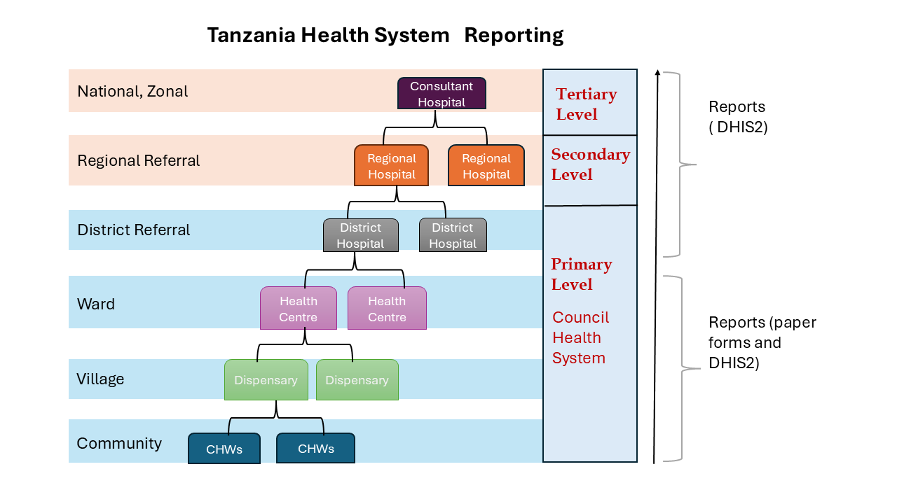
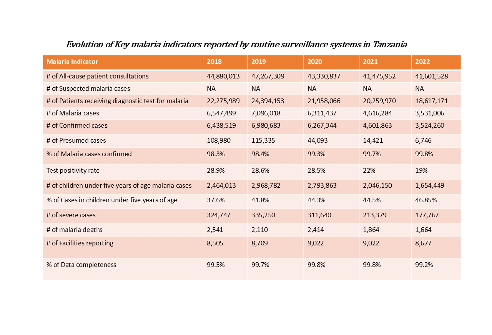
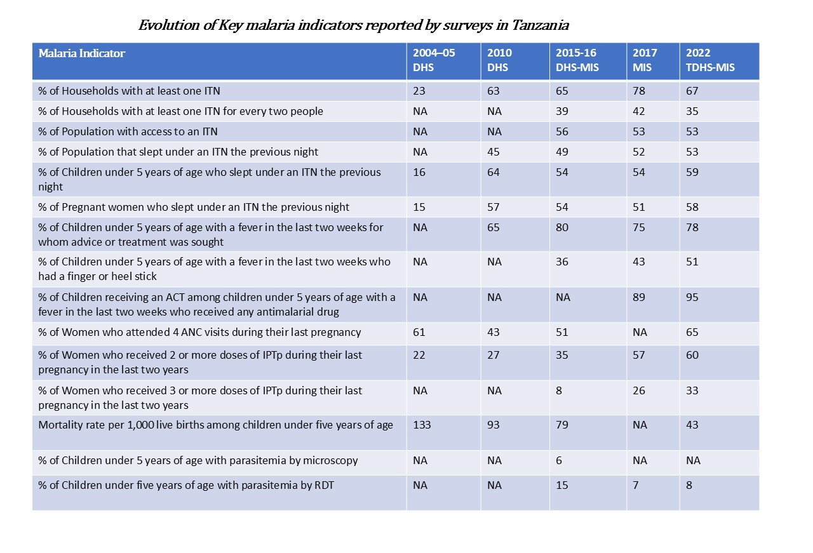
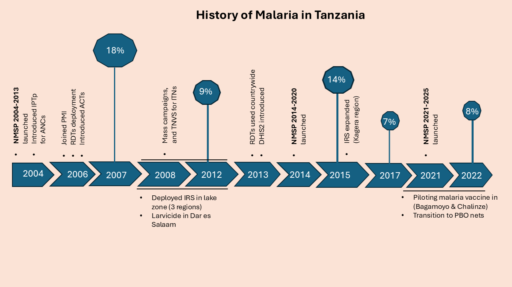
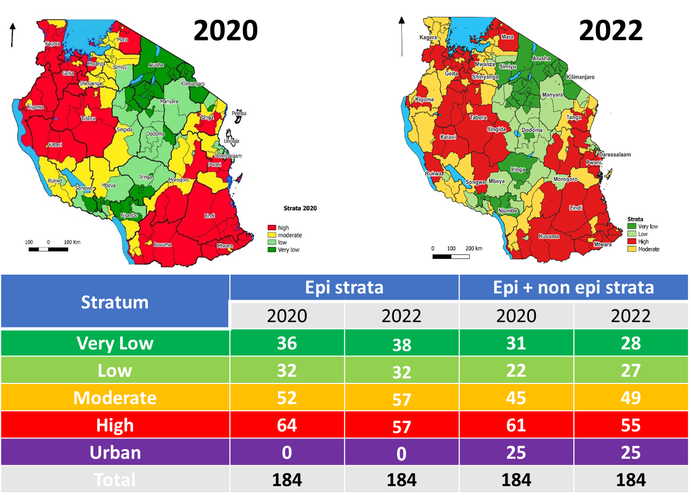

```{r, echo=FALSE, out.width='20%', fig.align='right'}
knitr::include_graphics("logos/map_logo.png")

```


---

### **Tanzania Malaria Epidemiology Summary**


---


#### **Introduction**

Tanzania is located in East Africa, borders Kenya and Uganda to the north, Rwanda, Burundi, and the Democratic Republic of Congo to the west, Zambia, Malawi, and Mozambique to the south, and the Indian Ocean to the east. Its population was about 62 million people in the 2022 population and housing census, the official languages are Swahili and English. According to the World Malaria Report 2024, Tanzania accounted for approximately 4.3% of global malaria deaths in 2023.

#### **Administrative Boundaries**

Mainland Tanzania's administrative structure consists of regions and councils, with each region comprising an average of seven councils. Councils, categorized as district (rural), town, municipal, or city (urban), are subdivided into divisions, wards, and villages. They play a pivotal role in implementing public services and health policies, including those of the Ministry of Health and the National Malaria Control Program (NMCP). Currently, there are 26 regions and 184 councils.


```{r, echo = FALSE, message=FALSE}
# Load Libraries
library(ggplot2)
library(sf)
library(dplyr)
library(ggthemes)
library(ggspatial)
```

```{r, echo = FALSE, message=FALSE, warning=FALSE}
# Load the shape file of Tanzania map.
tz <- st_read("TZN/TZA_ADMN03/Districts and TC as 2020.shp", quiet = TRUE)
# Load the file with water bodies.
tz_water <- st_read("TZN/TZA_ADMN03/water_bodies.shp", quiet = TRUE)
# Load the file with international boundaries.
int_bond <- st_read("TZN/TZA_ADMN03/international_boundary.shp", quiet = TRUE)
# Load the file for the national parks.
prot_areas <- st_read("TZN/ProtectedAreas/pad-tanzania.shp", quiet = TRUE)
```

```{r, echo=FALSE, message=FALSE, warning=FALSE}
# Validate and repair geometries
tz <- tz %>%
  mutate(geometry = st_make_valid(geometry)) %>%
  filter(!Region_Nam %in% c("Kaskazini Pemba", "Kaskazini Unguja", "Kusini Pemba", "Kusini Unguja", "Mjini Magharibi"))

# Check if all geometries are now valid
if (all(st_is_valid(tz))) {
  # Group by regions and union geometries
  regions <- tz %>%
    group_by(Region_Nam) %>%
    summarise(geometry = st_union(geometry), .groups = "drop") %>%
    st_as_sf()
} else {
  stop("Some geometries are still invalid after repair!")
}
```


```{r, echo=FALSE, message=FALSE, warning=FALSE, out.width="100%"}
# Calculate centroids for regions
region_labels <- regions %>%
  mutate(centroid = st_centroid(geometry)) %>%
  st_drop_geometry() %>% # Drop the original geometry
  cbind(st_coordinates(st_centroid(regions$geometry))) # Add coordinates for labels
# Data for cities
cities <- data.frame(
  name = c("Dar es Salaam", "Dodoma"),
  latitude = c(-6.7924, -6.1630),
  longitude = c(39.2083, 35.7516),
  type = c("Main City", "Capital City"))
# Add data for Mount Kilimanjaro
kilimanjaro <- data.frame(
  name = "Mt. Kilimanjaro",
  longitude = 37.3556,
  latitude = -3.0674
)
# Subset water bodies for labeling
bigwater <- tz_water %>%
  filter(LAKES %in% c("Lake Victoria", "Lake Tanganyika", "Lake  Nyasa", "Indian Ocean"))

# Make the plot
ggplot() +
  # Add background, councils, and regions
  geom_sf(data = tz, fill = "grey95", color = "#C2B9B0", 
          size = 0.5, alpha = 0.5) +
  geom_sf(data = regions, fill = NA, color = "#000033",
          size = 1, alpha = 0.5) +
  # Add water bodies and protected areas
  geom_sf(data = tz_water, aes(fill = "Water Bodies"), color = NA) +
  geom_sf(data = prot_areas, aes(fill = "National Parks"), 
          alpha = 0.5, color = NA) +
  # Add city points, mapped to fill for inclusion in the legend
  geom_point(data = cities, aes(x = longitude, y = latitude, fill = type),
             size = 3, shape = 21, color = "black") +
  # Add region labels
  geom_text(data = region_labels, aes(x = X, y = Y, label = Region_Nam),
            color = "darkblue", size = 2, fontface = "bold") +
  # Add Mount Kilimanjaro as a text label
  geom_point(data = kilimanjaro, aes(x = longitude, y = latitude), 
             size = 3, shape = 17, fill = "red", color = "black") +
  geom_text(data = kilimanjaro, aes(x = longitude, y = latitude, label = name),
            color = "darkred", size = 2, fontface = "italic", hjust = -0.1) +
  # Add water body labels
  geom_sf_text(data = bigwater, aes(label = LAKES, angle = 90), 
               color = "darkblue", size = 2, fontface = "italic") +
  # Add title and legend
  labs(
    title = "Geographical Map of Mainland Tanzania",
    subtitle = "Highlighting Regions and Councils",
    caption = "Data Source: NBS & Protected Planet",
    fill = "Legend"
  ) +
  # Manual scale for legend, combining water bodies, National parks, and cities
  scale_fill_manual(
    values = c(
      "Water Bodies" = "#87CEEB",
      "National Parks" = "#98FB98",
      "Main City" = "#A52A2A",
      "Capital City" = "blue"
    )
  ) +
  # Customize theme
  theme_map() +
  theme(
    plot.background = element_rect(fill = "azure", color = NA), # Backgr color
    plot.title = element_text(size = 14, face = "bold", hjust = 0.5),
    plot.subtitle = element_text(size = 12, hjust = 0.5, color = "darkgrey"),
    plot.caption = element_text(size = 8, face = "italic", hjust = 0.5),
    axis.text = element_blank(),
    axis.ticks = element_blank(),
    axis.title = element_blank(),
    panel.grid = element_blank(),
    legend.title = element_blank(),
    legend.key.size = unit(0.5, "cm"),
    legend.position = c(0, 0),
    legend.justification = c(0,0)
  ) +
  annotation_north_arrow(location = "tl",
                         height = unit(0.8, "cm"),
                         width = unit(0.4, "cm")) +
  annotation_scale(location = "tr")
```

#### **Health System Reporting**

The Tanzanian National Health System operates under a centralized government structure,where the Ministry of Health (MoHCDGEC) and the President’s Office for Regional Administration and Local Government (PO-RALG) share responsibilities for public health services. The MoHCDGEC handles policy-making, guidelines development, and monitoring, while directly managing referral hospitals.

There are 10,269 registered and functional health care facilities in Tanzania, including hospitals, health centers, and dispensaries. The healthcare system in Tanzania is based on hierarchical system represented by administrative level, type and function of facility. The system includes referral structure from primary health care to tertiary level.Dispensaries, health centers and district hospitals serve as primary level services, while regional hospitals are the secondary level services for referrals from district hospitals, zonal hospitals serve as referrals from regional hospitals, and finally, national hospital is a referral from both zonal and regional hospitals. Both zonal and national hospitals serve as tertiary level services. In addition, there are specialized hospitals that do not fit directly into this hierarchy and therefore are directly linked to the ministry of health.

Malaria diagnostic and treatment services are offered by 6,357 public institutions, 873 faith-based organizations, and 1,014 private health health facilities. Preventive therapies for pregnant women are offered in over 7,000 reproductive, child health clinics. About 40% of patients with fever seek treatment at private health facilities.

Moreover, community health workers (CHWs) play important role by routinely collecting community health data during household visits and community activities, and facilitating referrals from community level to health facilities. CHWs use MTUHA Book No. 3 for daily data collection, with tools stored at the health facility. Monthly, the facility in-charge will compile summaries into MTUHA Book No.10 for entry into the HMIS/DHIS2 system or submission to the council for entry ([Community Health Roadmap](https://www.communityhealthdeliverypartnership.org/media/526/file/Tanzania+mainland+approved+CHR+profile+24th+Nov+2023.pdf.pdf)). Currently, there are 20,487 CHWs and the country plans to reach over 150,000 CHWs in the period of 5 years.

```{r echo=FALSE, out.width="100%"}

```

#### **Types of Malaria Data**

Mainland Tanzania adopted the District Health Information System (DHIS2) platform in 2013 by transitioning the national routine health information system (RHIS), and integrating the electronic Integrated Disease Surveillance and Response (e-IDSR) for priority disease into DHIS2. The data flow from health facilities (HFs) through councils and regions to the national level. The key malaria indicators reported through routine surveillance system are shown in the table below. 

```{r, echo=FALSE, out.width="100%"}

```

We have compiled the common national surveys along with the malaria indicators collected. Additionally, the Tanzania National Malaria Control Program (NMCP) conducts the School Malaria Parasitaemia Survey (SMPS) every two years to monitor malaria prevalence among primary school children. However, this data is not publicly available. The most recent survey was conducted in July, 2023 ([UDSM DHIS2 LAB](https://dhis2.udsm.ac.tz/project/school-malaria-parasitaemia-survey-smps-in-cmis/)).

```{r, echo=FALSE, out.width="100%"}

```


#### **History of Malaria**

The graphic below illustrates the trend of malaria prevalence in Tanzania since 2004, alongside significant events that have occurred. The prevalence values are based on data from Demographic and Health Surveys (DHS) and Malaria Indicator Surveys (MIS). Additionally, the country has implemented three National Malaria Strategic Plans (NMSPs) at varying intervals.

```{r echo=FALSE, out.width="100%"}

```

#### **Weather and Seasonality**

Tanzania's tropical climate, shaped by its diverse topography, influences malaria transmission. Coastal regions are warm and humid, lake regions have relatively high temperature and humidity and heavier rainfall, while the Central Plateau (semi-arid) and Highlands (temperate) are cooler with seasonal variations. Rainy seasons (March–May and October–December in the north/east; October–April/May in central/south/west) and high humidity align with peak malaria transmission periods.

```{r, echo=FALSE, warning=FALSE}
regseason <- regions %>%
  mutate(
    rainy_season = case_when(
      Region_Nam %in% c("Dar-es-salaam", "Tanga", "Pwani", 
                        "Lindi", "Arusha", "Manyara",
                        "Kilimanjaro", "Morogoro") ~ "Mar–May & Oct–Dec",
      TRUE ~ "Oct-Apr/May"
    )
  )

```


```{r, echo=FALSE, warning=FALSE, out.width="100%"}
# Make the plot
ggplot()  +
  geom_sf(data = regseason, aes(fill = rainy_season),  color = "grey", alpha = 0.5) +
  scale_fill_manual(values = c(
    "Mar–May & Oct–Dec" = "#94E4CB",  
     "Oct-Apr/May" = "#F9F6CD"
  )) +
  geom_sf(data = tz_water, fill = "#87CEEB", color = "grey", alpha = 0.5) +
  # Add region labels
  geom_text(data = region_labels, aes(x = X, y = Y, label = Region_Nam),
            color = "darkblue", size = 2, fontface = "bold") +
  theme_map() +
  labs(title = "Rainy Seasons in Mainland Tanzania",
       subtitle = "Rainy Seasons Associate With Peak Transmission",
       fill = "Rain Seasons") +
  theme(plot.background = element_rect(fill = "azure", color = NA),
        plot.title = element_text(size = 14, face = "bold", hjust = 0.5),
        plot.subtitle = element_text(size = 12, color = "darkgrey", hjust = 0.5),
        axis.title = element_blank(),
        axis.text = element_blank(),
        panel.grid = element_blank()
        )+
  annotation_north_arrow(location = "tl",
                         height = unit(0.8, "cm"),
                         width = unit(0.4, "cm")) +
  annotation_scale(location = "tr")
  
```


#### **Current Stratification Map**

Malaria risk stratification, updated in 2022, was based on councils and derived using key indicators: parasite prevalence in school children, fever test positivity, annual parasite incidence (API), confirmed malaria incidence, and test positivity in pregnant women. Scores were assigned per NMCP-defined strata (very low (<1%), low (1–5%), moderate (5–30%), and high (>30%)) and summed across indicators. Urban councils were categorized separately, reflecting unique operational and intervention needs.

```{r echo=FALSE, out.width="100%"}

```

_**Description**: Malaria stratification along with the table summarizes the number of councils in each epidemiological and non-epidemiological strata.
<br> **Source**: U.S.President's Malaria Initiative Tanzania (Mainland) Malaria Profile_

#### **Reference**

1. [PMI malaria operation plans](https://www.pmi.gov/)
2. [Malaria HIS portals](https://malariaportal.org/index.php/country-rhis-profiles)
3. Tanzania National Malaria Strategic Plan (NMSP 2021-2025)
4. Tanzania National Bureau of Statistics (NBS)
5. [Severe malaria observatory](https://www.severemalaria.org/)
6. [Community health roadmap](https://www.communityhealthdeliverypartnership.org/media/526/file/Tanzania+mainland+approved+CHR+profile+24th+Nov+2023.pdf.pdf)
7. [National guidelines for integrated malaria vector control in Tanzania     ](http://api-hidl.afya.go.tz/uploads/library-documents/1621438892-H1A9nEDv.pdf)


